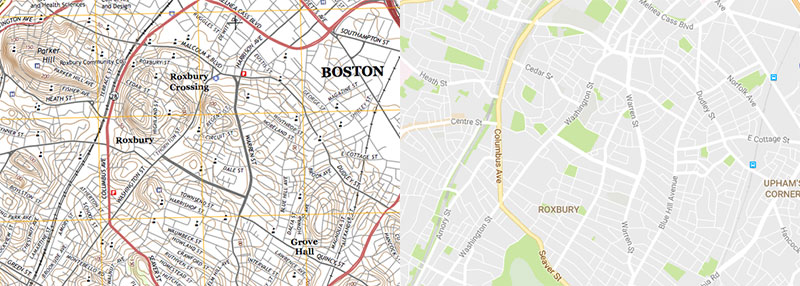
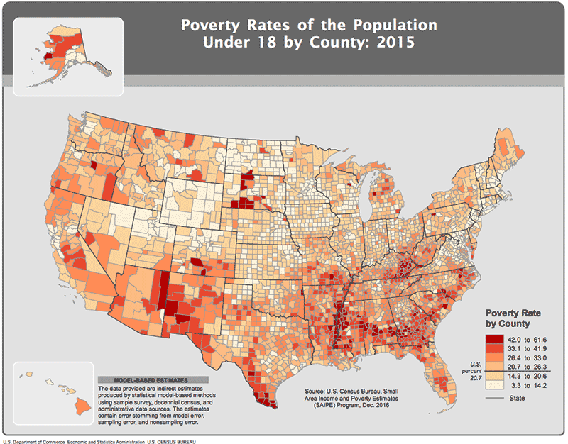

It may sound silly to ask what a map is, but it's important to understand the **what** and **why** of maps.

A simple definition is that **a map is a *representation* of a place.** This carries two important implications that are sometimes neglected:

1. _A map is not an objective depiction of reality._ It is a symbolic interpretation of place and highlights the relationships between elements in space, either perceived or actual. It reflects choices, biases, and agendas of the mapmaker. When you see or make a map, think critically about it. What does the map show, what does it omit, and why? How were the data collected and manipulated to produce the end result? Those are only a couple of things that affect how a map ultimately is interpreted by its readers.

2. _The practice of cartography is as much about removing things as depicting them._ A map does not and cannot represent everything in the place. Things must be omitted, simplified, etc. for the map to make sense. This is how a map achieves clarity and usefulness: it strips away details of the world so that the map's purpose shines through.

### Types of maps

Broadly, maps fall into two categories:

**Reference maps** emphasize the **location** of spatial phenomena, such countries, cities, rivers, etc. Chances are the maps you use most in your daily life are reference maps—street maps (e.g., Google Maps) that help you see _where things are_. Other common reference maps emphasize physical landscapes—think topographic maps or maps of a national park.

USGS topographic maps and Google Maps are classic and modern examples of reference maps, mostly intended to show where things are.  

**Thematic maps** emphasize the **spatial pattern** of geographic _attributes_ or _statistics_ about places and relationships between places. For example, while a reference map might show the locations of cities, a thematic map might also represent the population of those cities. A reference map might show bank locations, while a thematic maps shows average income in an area. It's the difference between mapping _places_ and mapping _data_.

 
This map of poverty from the US Census is a thematic map, concerned with the geography of a demographic phenomenon.