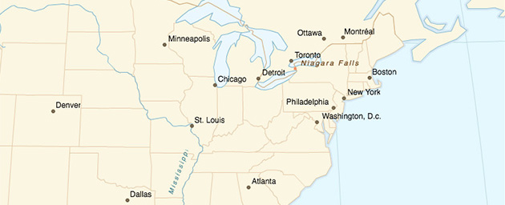
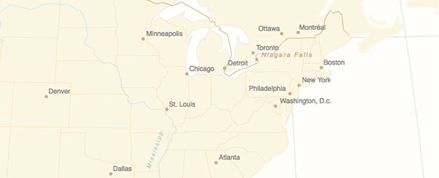
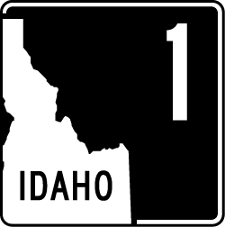

Good **visual hierarchy** is crucial to overall effective map design. Visual hierarchy is the organization of design such that some things seem more prominent and important, and others less so.

### What are the different elements around the map, and what are their relative importance?

A map's **visual** hiearchy should match its **intellectual** hierarchy. What is the purpose of the map? What elements are most important? Make those elements stand out and let other, more ancillary elements be more subtle. Where your eye goes first when you look at the map is the element that has the highest level in the visual hierarchy—make sure that element is something important.

### Figure-ground

One key to visual hierarchy is understanding **figure-ground** relationshops. _Figures_ are the elements that stand out visually, while the rest of the image comprises _ground_. In other words, some things appear prominently as foreground, and others as background. **Color** and **contrast** play an important role in figure-ground relationships. The less contrast in a map, the poorer the figure-ground effect, and likely the poorer the overall hierarchy. Your map has some background color, whether it's a blank white page or something else. For elements that are important, use colors that are noticeably different from the background, especially in terms of lightness.

  
Good use of figure-ground. Color and brightness contrast let the land come forward from the ocean, and things like the river come forward from the land.

  
Not so good figure-ground. Low contrasts make it harder and slower to pick out any salient elements.

Figure-ground effects can be ambiguous even with high contrast, causing unstable perception of foreground and background, for example in the famous [Rubin's vase](https://en.wikipedia.org/wiki/Rubin_vase) image. With maps this can come into play as an inversion between land and water (especially if using unconvential colors for water), or more generally a tendency to see the background as an important object. Consider the Idaho highway sign below: it may first appear as a person's face in profile instead of the shape of Idaho. Other ways of separating the Idaho shape might improve this, perhaps using additional strokes or placing the state in the center rather than the corner.

  

### Designing and assessing good visual hierarchy

Recall that certain [visual variables]({{site.baseurl}}/guide/general/visual-variables) are _ordered_, in particular size and color value. Generally speaking, larger objects appear more important and will draw the eye, as will darker objects (assuming a light background). If something is important, or repesents something that literally is big, make its symbol bigger and bolder than others. Keep in mind the impact of size and color on hierarchy when using those variables to symbolize numerical data. For example in a choropleth map, one end of the color ramp is likely to draw the eye more than the other, so ideally that end should represent the more "important" or notable part of the data.

Visual hierarchy goes beyond the map itself. A map exists in some kind of page, be it paper or on the web, and likely is surrounded by supporting elements like titles, text, or charts. This overall layout should have an appropriate hiearchy too. If the map is the most important part of the story, it should be as large as possible. Skip that gigantic north arrow!

An easy, non-scientific way to evaluate visual hiearchy is a "squint test." If you stand back or squint to blur the map, do the important elements still stand out?

More guidelines on map hierarchy:  

* [https://www.e-education.psu.edu/geog486/node/1858](https://www.e-education.psu.edu/geog486/node/1858)