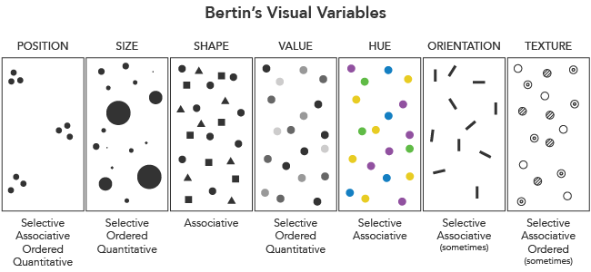
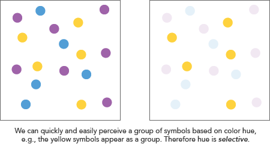
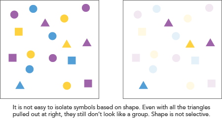
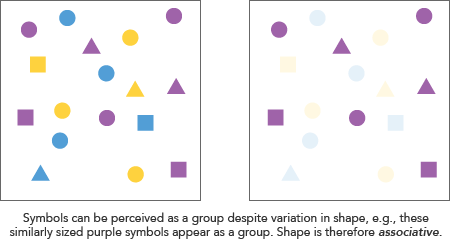
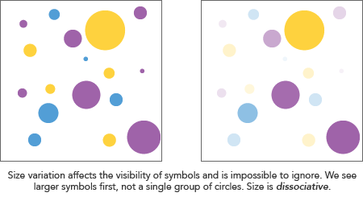
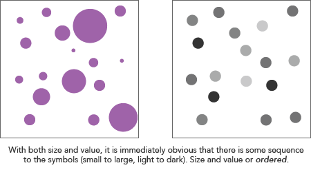
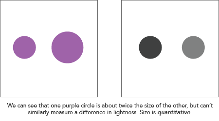

**Visual variables** are "the differences in map elements as perceived by the human eye" ([wiki.gis.com](http://wiki.gis.com/wiki/index.php/Visual_Variables)). No matter what the type of map, these are the fundamental ways in which graphic symbols can be distinguished. 

[Jacques Bertin](https://en.wikipedia.org/wiki/Jacques_Bertin) proposed an original set of "retinal variables" in _Semiology of Graphics_ (1967):

- Position
- Size
- Shape
- Value (lightness)
- Color hue
- Orientation
- Texture

The list has since been further expanded by other researchers (see [Roth, forthcoming](https://www.geography.wisc.edu/faculty/roth/publications/Roth_2015_EG.pdf)), including Joel Morrison:

- Color saturation
- Arrangement

...and Alan MacEachren:

- Crispness
- Resolution
- Transparency

### Properties of visual variables

Bertin described four "levels" of how visual variables are perceived, which have implications in their use for map symbols. 

A **selective** variable allows us to immediately isolate a group of signs based on a change in the variable.

Shape is the only one of Bertin's variables that he thought is *never* selective, along with orientation when used for area representation (e.g., polygons symbolized by differently angled stripe patterns).

*What does this mean for maps?* A quick rule of thumb here is to avoid visual variables that are not selective (i.e., shape) if you want to highlight patterns. For example, on a reference map you might use symbols with different shapes to represent banks, hospitals, and schools. However, if these institutions are related to the *theme* of a map and you want readers to quickly identify the spatial patterns of them, use a different variable such as color to distinguish them from one another.

An **associative** variable allows grouping across changes in the variable; in other words, a variable is associative if we can perceive symbols as a group despite differences in this variable. Note that this does not mean the variable is not selective. For example, hue is both: we can easily select symbols of the same color, but a group of differently colored symbols is itself also perceptible as a group.

Another way to think of this is whether a variable affects the apparent "weight" or *visibility* of symbols. To quote Bertin:

> An associative variable does not cause the visibility of the signs to vary. [...] A dissociative variable causes the visibility of the signs to vary.

Of Bertin's variables, value (lightness) and size are dissociative. Both affect the visiblity of symbols (bigger symbols are more "visible" for example), and thus it is not possible to perceive a group despite variations in these.

*What does this mean for maps?* Understanding associative variables essentially means being aware of what will break the perception of "sameness" in a map. Size and color value will do this, so avoid them if you want symbols to appear as some kind of group. For example, if you have a reference map of banks, schools, and hospitals, keep their symbols around the same size, as they all belong to the same broad category of civic institutions.

**Ordered** variables have an immediately recognizable sequence. In other words, if you can order the symbols by their difference in a variable without having to consult a legend, the variable is ordered. Size and value, for example, have an immediately perceptible order. Position does too: symbols can naturally be seen as ordered from left to right or vice versa, for example. Color hue is an example of a non-ordered variable: there is no clear ordering of, say, red, green, and blue.

*What does this mean for maps?* When mapping numerical data, which most of the time has some order, employ ordered visuable variables in your symbolization. Conversely, avoid ordered variables for things that have no natural order. For example, don't use differences in lightness to represent ancestry groups from census data.

**Quantitative** variables allow an estimation of the actual numerical difference between symbols. Besides position, where we can guess the measurable distance between symbols, Bertin considered only size variation to be quantitative. For example, we can easily see that one symbol is twice the size of another—more or less. 

*What does this mean for maps?* Although it sounds like size variation is the only acceptable way to represent numerical data according to Bertin, that's not a rule. It's perfectly common—more common, perhaps—to use *ordered* but non-quantitative variables, such as color value. Just be aware that differences of magnitude aren't immediately perceptible by the reader without looking at a map legend. Furthermore, be aware that even with size, visual estimation of quantitative differences is imperfect. "We must remember that quantitative perception represents an accurate approximation but not a precise measurement," Bertin writes. Other scholars have studied in more detail how human estimation of size (and area) works.

### Understanding visual variables for cartography

In a practical setting, when you sit down to design a map, your first question is not likely to be "what visual variables should I use?"—instead you're probably going to think about general types of maps. It's not always a choice of one visual variable over another, as many symbolization strategies employ variation in more than one.

Rather, an understanding of visual variables is important as a step toward knowing _how_ those different types of map work, and knowing how your choice of symbols implies or doesn't imply patterns, groups, order, and quanitity. As we look at different map types in further detail, you'll see how visual variables come into play.