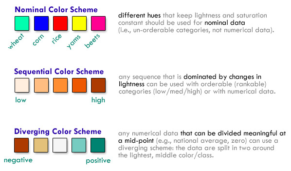

Color can be a challenging design elements to perfect. It takes experience and a designer's eye to produce pleasing and effective color schemes, but there are also some guidelines to follow. Recall that dimensions of color have powerful effects as [visual variables]({{site.baseurl}}/guide/general/visual-variables), causing the eye to see groups, order, or some combination thereof. Choosing colors carefully based on the nature of the data you're mapping will ensure that the map's message is made clear.

### Controlling the Three Dimensions of Color

The success of many thematic maps, such as [choropleth maps]({{site.baseurl}}/guide/univariate/choropleth), depends upon understanding how we manipulate colors to systematically encode our geographic data using the three dimensions of color: **hue, lightness,** and **saturation**. Unlike picking colors for your living room, the use of color on maps is far less subjective than most people suspect and we don't pick the colors on maps simply because "they look nice." Rather, there are important rules that govern how color schemes work and how those colors relate to the data. Furthermore, there are important perceptual constraints that are well known, such as red-green colorblindness (affecting roughly 8% of males), which require we design with these issues in mind and not merely pick what looks nice to us personally. The good news is that the rules that govern how to use color on maps, as well as solutions to problems like red-green color blindness, are well understood and fairly easy to follow.

### The nature of your thematic data dictates what kind of color scheme you need

Nominal data are categories that are inherently unorderable (like soils or landuse) and should only be mapped with **nominal color schemes**. If you have orderable categories (such as low/med/high) or if you have numerical data, a **sequential color scheme** is what you need. Sequential color schemes can be single or multi-hue, but they are dominated and ordered by differences in lightness/saturation. **Diverging schemes** should only be used when your data has a natural mid-point such as a zero (e.g., positive and negative change/growth) or if you want to compare places to something like the national average (e.g., county data showing places that are above and below the national average for a variable like per capita income). A good place to find color schemes of each type is [ColorBrewer](http://www.ColorBrewer2.org), where you can also find more detailed discussions of their characteristics.

### Perceptually-Graded Schemes

The color schemes in ColorBrewer are perceptually graded ([pdf](http://www.geography.wisc.edu/~harrower/pdf/ColorBrewer2003.pdf)) so that the amount of color change in each color step looks consistent to our eyes. We have to do this because humans do not perceive differences in all hues equally well. Making professional color schemes like this isn't easy, especially if you are varying all three dimensions of color simultaneously as many of the multi-hue sequential and diverging scheme dos. While you shouldn't feel restricted to [ColorBrewer](http://www.ColorBrewer2.org), it does provide tested, reliable color schemes to get you started. Gregor Aisch has written more on [how perceptually graded multi-hue color schemes work](https://vis4.net/blog/posts/mastering-multi-hued-color-scales/) and how to create them.

### Colors in reference maps

Reference maps to some extent allow more creative freedom in color choices, as you are not bound to the restrictions of accurately depicting numerical relationships. While you should be aware of some cartographic conventions (blue for water, green for natural areas, etc.), the choice of color scheme is often up to you, based on the desired aesthetic, the medium and purpose, and so on. Good color choices are something you learn with experience and inspiration from others, but there are a number of resources for generating or sharing pleasing and effective color schemes (see below).

That said, in reference mapping sometimes the challenge is finding color schemes that *don't* convey relationships. For example, if you use two different shades of red for two totally different types of feature, they may appear related, and possibly even ordered. For clear distinction between categories of features, rely on hue, potentially varying lightness and saturation within that category if there are ordered subsets (major roads versus minor roads).

### Creating color schemes

There are many helpful tools and community sites for creating color schemes! A few are listed below. The first few (including the aforementioned ColorBrewer) are good mostly for choropleth color ramps; the next few are for general color palettes.

- [ColorBrewer](http://www.colorbrewer.org)
- [chroma.js](https://github.com/gka/chroma.js) by Gregor Aisch and its [helper tool](https://gka.github.io/palettes/)
- [Colorpicker](http://tristen.ca/hcl-picker/) based on chroma.js
- [Adobe Color CC](https://color.adobe.com/)
- [color-hex popular palettes](http://www.color-hex.com/color-palettes/popular.php)
- [COLOURlovers](http://www.colourlovers.com/palettes)