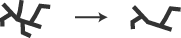
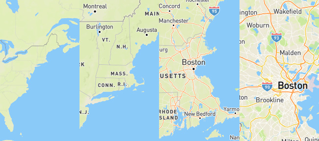

### The meanings of scale

The word **scale** has a few different uses related to mapping.

- **Geographic scale** is "scale" in the sense you may be used to in everyday life, referring to the general scope or extent of things. In this sense, "large scale" for example means something affecting or covering a large area, like a country or even the whole planet.

- **Cartographic scale** may sound backwards at first blush. In the cartographic sense, "small scale" essentially means more "zoomed out" than large scale. Scale on a map is defined mathematically, often expressed as a _representative fraction_. For example, many USGS topographic maps have a scale of 1:24,000. This means that one inch on the map represents 24,000 inches in the real world. If you "zoomed in" an inch would represent less real-world distance, say 10,000 inches; thus the fraction (1/10,000) actually becomes a larger number and the maps scale is said to be larger. Remember it this way: an area appears larger on a large scale map, and smaller on a small scale map.

- **Data** has scale too, in that it was collected or digitized at some resolution, which has implications for the map scale at which it can be displayed. Ideally a map should not have a larger scale than its data. For example Census data collected at the block level works well on a large scale map, but state-level data can't be extrapolated down to block level and displayed as such. Scale or resolution also applies to how detailed the actual vector or raster geometry is.

### Generalization

At its core, cartography is about _abstraction_. We don’t show data in its raw form; we clarify it in a variety of ways, often by removing things. It simply isn’t possible to show every tiny detail! Data and graphics should be _generalized_ appropriately to the map scale: basically, a large scale a map can (and often should) have more detail than at small scale. 

Common generalization tasks include:

-----

  
**Selection:** choosing which objects to include on the map

-----

  
**Simplification:** reduce the number of vertices in an object

-----

  
**Smoothing:** reduce sharp angles to smoother curves

-----

  
**Aggregation:** group points into areas

-----

  
**Amalgamation:** group areas into larger areas

-----

  
**Collapse:** reduce a detailed object to a point symbol

-----

  
**Merge:** grouping of line features

-----

  
**Refinement:** select only portions of an object to display

-----

  
**Exaggeration:** amplify a part of an object (for clarity)

-----

  
**Enhancement:** add detail that visually elevates an object

-----

  
**Displacement:** separate objects (for clarity)

### Multi-scale map design

Generalization is a hugely important task in modern mapping, as many web maps cover a wide scale range and thus many different levels of generalization. Increasingly, some of the work is done for you behind the scenes, algorithmically. For example, consider Mapbox's OpenStreetMap-based vector tiles, which deliver data pre-simplified to levels appropriate for various scales:

Notice how coastline, roads, labels, etc. become more detailed as the map is zoomed in. Part of that is because the data itself is simplified. In this case that's done automatically, but in other scenarios you may need to do it yourself, using a tool like [Mapshaper](http://mapshaper.org/) to create several different versions of your data, simplified to different levels.

The other half of the equation, of course, is the cartographer's design choices. Most map design tools, including GIS software, allow you to specify style rules according to scale. Generally speaking, in addition to objects becoming more numerous and detailed at larger scales, points, lines, and labels should become larger at larger scale.