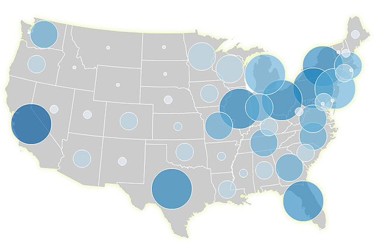

### When to Use

Bivariate proportional / graduated symbol maps combine two datasets (usually numerical data) into a single hybrid map symbol. They are very efficient because the size of the symbol tells you one thing and the color/fill tells you another. These maps exemplify the power of bivariate maps by allowing us to easily examine geographic relationship between two variables (like _income_ and _education_). They inherit many of the strengths and weaknesses or univariate proportional symbol maps, outlined [here]({{site.baseurl}}/guide/univariate/proportional-symbols). Like single-variable graduated symbol maps (in which the size and color of the symbol show the same data), an important decision here is whether or not to [group your data into classes]({{site.baseurl}}/guide/data/data-classification) or to show unfiltered "raw" data (assuming your data aren't already classed for you, in which case, the decision is moot).

### Example Map

This is a 5-class x 5-class bivariate graduated symbol map that uses [natural breaks classification]({{site.baseurl}}/guide/data/data-classification) method and [sequential color scheme]({{site.baseurl}}/guide/general/using-colors-on-maps). While this map uses orderable (ordinal or ratio) data for both size and color, color on a bivariate proportional symbol map could also encode categorical data represented by a qualitative color scheme.

