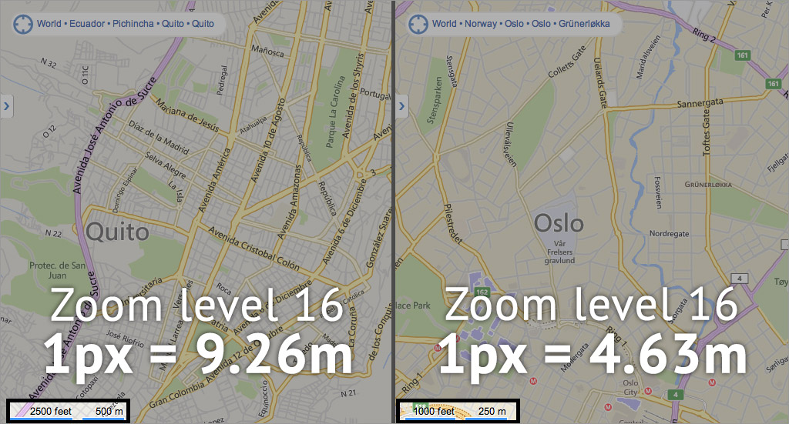

"Web map" often implies a map that is not simply on the web, but rather one that is _powered_ by the web. A **digital map** is on a computer, but may not be accessible by internet, and is relatively static if it is. A **web map** depends on the internet. It is usually interactive and not always self-contained.

### Powered by the web

Web maps, in contrast to a simple static map image that resides on the web, _rely_ on the web in order to exist and function. This means one or more of a few things:

* **Web technology:** web maps are built with the technology of the web, such as HTML, JavaScript, and CSS. (Most web maps involve at least those three in particular.) A web map runs on technology that can be consumed by standard web browsers, including, ideally, mobile web browsers.

* **Server-side communication:** a web map might rely on the internet to provide its data (say, stored in an online database) or perform calculations. This means that web maps can contain vastly more information than can possibly be presented to you at any single moment. It's quite a powerful contrast to the paper maps of old—imagine a map with such massive amounts of information as Google Maps, and trying to fold that up into your pocket!

* **Drawing from outside sources:** on the web it's not always necessary to collect all data sources in one place before mapping them—the map itself is that collection. Many data providers have APIs into which a map can tap directly every time a user views the map, eliminating the need to download all that data beforehand.

* **Real-time data:** being connected to the internet, many web maps make use of real-time, live data feeds so that they are constantly up to date on whatever they're showing. This, of course, is another thing that was never possible with traditional maps, which always necessarily represented a snapshot in time.

### Anatomy of a web map

In many contexts "web map" has an even narrower definition, a category of map that will be described here in further detail. It includes some of the maps you probably use almost every day, such as Google Maps.

#### Slippy maps

The typical form of web map is sometimes called a "slippy map." This is a type of map you're used to, like Google's: you can grab and pan the map, and zoom in or out. Google was a major pioneer of this type of map with the introduction of their map service in 2005. It represented a huge leap from the previous standard web map, where panning (in fixed amounts) or zooming essentially required reloading the entire map image with a new extent.

#### Tiles

Slippy maps accomplish their slick usability with _tiling_ schemes. In the old days, a map view was a single image. You had to load the whole thing before you could see it. Now, the map you see comprises many smaller tiles that load invididually. What this means is you _only load the part of the map you need._ For example if you want to look slightly east, you only need to load a new column of tiles on the right side instead of reloading the entire map. Tiling makes map viewing fast and data much more manageable.

A slowed-down example of how tiled maps load the visible map area piece-by-piece.

Tiles come in two flavors: **raster tiles** are pre-rendered images of map data, while **vector tiles** are small sections of the data itself, which is then rendered in the browser. Raster tiles are the original standard and are still very common, but vector tiles have moved to the forefront as technology has made live-rendering of map data feasible. Vector tiles are efficient and fast for a variety of reasons—see some technical explanations in [Tom MacWright's JS.Geo presentation on vector tiles](http://tmcw.github.io/presentations/jsgeo/).

Tiled maps use a standard **tiling scheme** which is worth understanding. Tiles are idenfied by three numbers, typically in this order:

1. **Zoom level**: the [scale]({{site.baseurl}}/guide/general/scale-and-generalization) of the map for this tile, relative to an initial scale at which the whole world fits in one tile. (More on this in a moment.)
2. An **X** coordinate: the **horizontal** position of this tile, within the grid of tiles for the world map at this zoom level. Usually, this number increases from left to right, with 0 being the left edge of the map, or 180º West longitude.
3. A **Y** coordinate: the **vertical** position of this tile, within the grid of tiles for the world map at this zoom level. Usually, this number counts up from top to bottom to right, with 0 being the top edge of the map, around 85º North latitude. (In the standard Mercator map projection of web maps, 85º latitude northern and southern limits allows everything to fit in a square.)

Tiles are typically numbered with [z, x, y] coordinates. This example is zoom level 2.

Each zoom level contains twice as many rows and columns as the previous level. With zoom level zero being a single tile for the whole world, this means the number of tiles for any zoom level _z_ is:

2z x 2z, or 4z

Notice the relationship of tile numbers in zoom level 3 (below) to those in zoom level 2 (above). Consider the top left corner of each tile in zoom level 2. When we increase the zoom level by one, the x and y for a tile with that same corner position on the map are multiplied by two. For example Norway is in tile [2,2,1] at zoom level 2, and [3,4,2] at zoom level 3.

Although the numbering pattern is different in a couple of systems, tile positions and extents are nearly universal and are well understood by code libraries such as Leaflet. Many are built to understand URL patterns for tile locations (tiles are stored online one way or another), such as  
`http://path-to-tiles/{z}/{x}/{y}.png`.

#### Map projections on the web

Standard slippy maps use the **Web Mercator** projection, much to the chagrin of many cartographers. There are a couple good reasons for this, though:

* The map is conformal (preserving shape) and represents all constant bearings as straight lines. What this boils down to is that you can zoom into the map anywhere in the world, and all shapes and directions will look more or less correct. This isn't true of other map projections, where, for example, Quito might look right but a high-latitude place like Anchorage would look terribly squished. (Compare "unprojected" on the left, below, with Mercator on the right.)  

* Almost the entire world fits neatly in a square. This makes the tiling scheme described above work very well.

However, it comes with a few pitfalls:

* **The Mercator projection is wildly inappropriate for some types of thematic maps.** (To say nothing of the generally distorted version of the world it presents.) [Choropleth]({{site.baseurl}}/guide/univariate/choropleth) maps and others that depend on correct area proportions should not be used with Mercator maps at small (global-to-continental) scales, as area distortions can be huge. Distortions are minimal at local levels, though.

* As implied above, **scale is not constant around the world.** Be suspicious if someone presents you with Google Maps screenshots of two different places "at the same scale." Zoom level is not the same as scale. At high latitudes, where areas are enlarged, a tile represents less area than near the equator.

* Although _most_ of the world fits in a square, not all of it does. In fact, it's impossible to represent the north and south pole at all—they stretch infinitely up and down! While the typical map, which cuts off at about 85 degrees north and south, doesn't miss much, it does miss something, notably much of Antarctica.