In the broadest terms, we may think of an _interactive map_ as one that can be changed in some way by user manipulation—even spinning a globe or sticking a pin in a wall map. Most commonly, however, when we talk about an interactive map we mean one that is:

1. Digital (displayed on a computer, tablet, smartphone, etc.)
2. Responsive to direct user manipulation (click, touch, etc.)
3. Changeable in some way

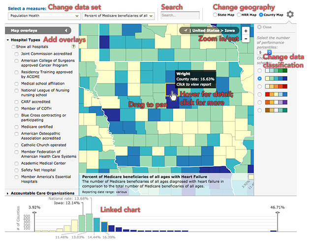  
A map with loads of interactivity.

### Types of map interaction

The different kinds of map interaction in large part overlap the kinds of digital and web interaction in general; indeed, many elements of web maps are standard web page elements used in support of a map. There is some [research toward taxonomies of cartographic interaction](http://geography.wisc.edu/faculty/roth/publications/Roth_2013_TVCG.pdf) specifically, however, such as that of Robert Roth.

In simpler terms, we look at map interactions as supporting a few general categories of tasks:

1. Map navigation: changing _where_ the map is focused
2. Search and filter: _finding_ specific objects or sets of objects
3. Information retrieval: getting _more information_ than what the map shows
4. Data manipulation: changing _what_ the map and supporting elements are showing

That's an approximate categorization based on our experience. Your mileage may vary. Besides our experiences, the recommendations in this article draw heavily from [Robin Tolochko's master's thesis research on interactive web map design](http://tolomaps.github.io/assets/Tolochko_Thesis.pdf), from which she developed some implementtion guidelines.

### Map navigation

For the most part, map navigation means panning and zooming by direct manipulation. A handful of methods are common and expected by users; if a map is going to support panning and zooming at all, it should support these methods as much as possible—and avoid unconventional and confusing methods. (Looking at you, maps that use scroll wheel to pan.)

- Click and drag (or touch and drag)
- Double click to zoom
- Scroll to zoom
- Pinch to zoom
- Arrow keys to pan *(important for accessibility!)*
- Plus and minus keys to zoom *(ditto)*s

Additionally, sophisticated data- or story-driven maps often fold automatic panning and zooming into interactions with the data or story, a helpful way to guide users through something potentially very complex. For example, clicking on the state choropleth map below zooms to a state and reveals data in finer geographic detail.

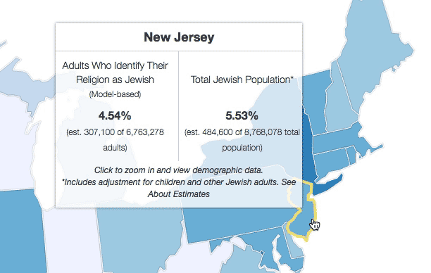

Or, in a map with a narrative story such as below, advancing through the story (via arrow buttons at the top left, among other methods) moves the map to different points of interest.

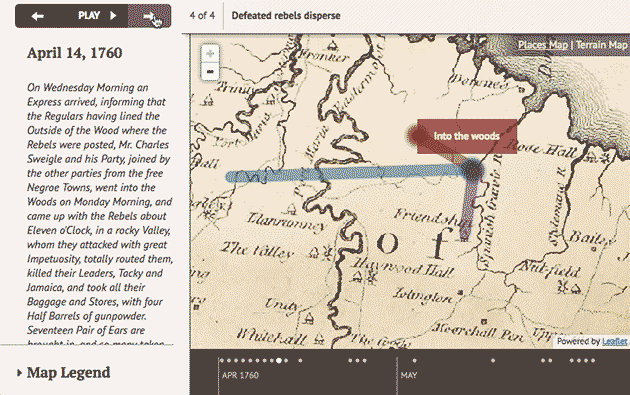

Notably, both of the above examples also allow free panning and zooming, as this is generally expected in web maps. The automated navigation is an extra touch to help guide users' attention to important things.

A final tip about panning and zooming: it's easy to get lost, so it's generally a good idea to include some kind of reset button for reverting the map to its default extent.

### Search and filter

Searching (looking for specific key words or phrases) and filtering (narrowing down data, for example by category) are common and powerful features of interactive maps that allow users to find what they're looking for amid what could be tons of data. Think of Google Maps: the map contains more information than you can imagine, whether it's visible or not, and its usefulness is in quickly finding what you want by typing in the search box.

Typically searching and filtering will ask one or more of three things:

- *Where?* Find the location of something
- *When?* Find something based on date or time
- *What?* Find something based on its name, description, etc.

#### Search

Google is both a blessing and a curse to the web cartographer. On the one hand, almost everyone is familiar and comfortable with searching; they know what to do with a text input box. On the other hand, they expect to be able to search anything and everything, with near-perfect accuracy. Most of us don't have the time, resources, or brainpower to build a search as smart and exhaustive as Google's.

Still, we do what we can. A good search addresses both the _where_ and _what_ questions and presents results in a clear, organized manner. _What_ is fairly straightforward to accomplish with text matching in names, descriptions, and/or attributes of the data. (This can blend into the _where_ question if attributes include place names.) _Where_ might tap into a geocoding service, but could also be limited to the universe of your data, for example searching a list of county names if your map uses county-level data.

**Set expectatins of what is searchable.**

In all cases, it's good to tame people's expectations of Google-quality search by stating what the search is capable of. We frequently use the `placeholder` attribute of text inputs as a hint about what is searchable.

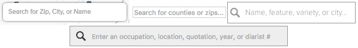

**Quick feedback is ideal.**

Autocomplete hints and live-updating results as the user types (i.e., not requring the Enter key or a button click), if possible, are good ways to give the user instant feedback about the scope of search, whether their query is decent, and that search even works in the first place. For example in the map below, the main contents of the map and sidebar themselves change as you type. In other cases, a list of results simply pops up after a certain minimum number of characters are entered.

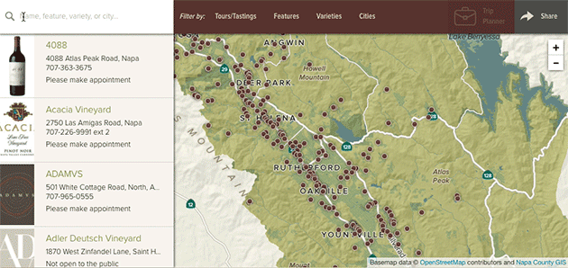

**Organize results in useful ways.**

Good organization of list-based results is helpful especially if data is vast and/or the search is multi-purpose (e.g., for both places and attributes), so that the user doesn't have to wade through a big list to find something. Even small ehancements, such as showing the number of results, are useful. Two examples of organized results are below, both of which separate results into categories. Notice that the second one also highlights the matching text, a small step (that could be expanded further) to help people understand why they got the results they did.

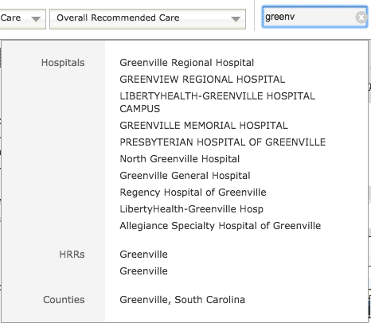
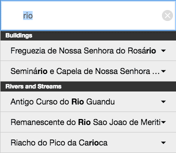

#### Filter

Filtering, quite often, accomplishes the exact same thing as a search, just approached from a different direction. Take that wineries map above, for example: the same results for that "pinot" search could have been achieved by clicking some filters in the "Varieties" menu. Filtering is more than just an alternative method for searching, though. It does a few things that are advantageous:

- shows the fundamental ways in which data could be organized
- allows viewing of groups of related things, not just a specific attribute
- better allows us to look through data by numeric values
- finds things that are not easily expressable as keywords

Most filter controls are implemented either as some kind of toggle (such as a checkbox) for looking at pre-defined categories or groups, or sliders for looking at ranges of time or data value. There are variations, though. See the variety on display below, for example.

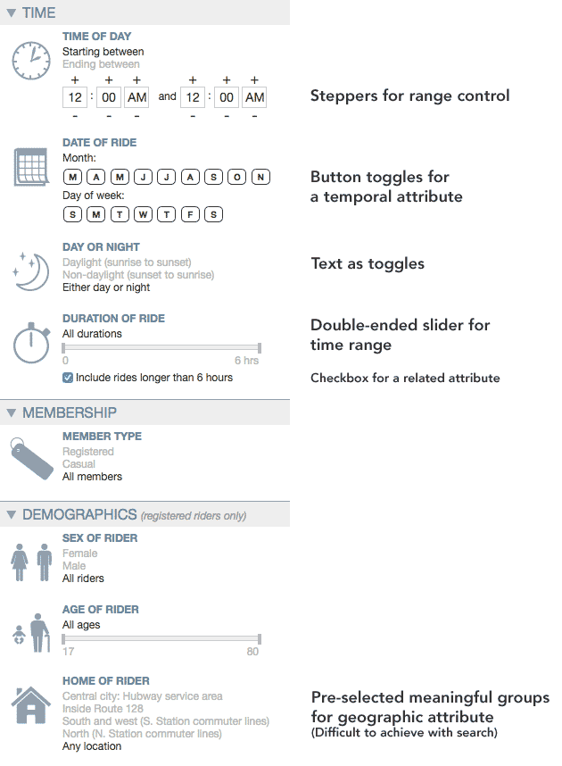

**Map and data displays can double as filter controls.**

Filters don't always need to be built as separate menus and panels, but can be integrated with other parts of a well-designed UI. In the first example below, the choropleth legend is used for filtering data value categories. In the second example, charts act as filters.

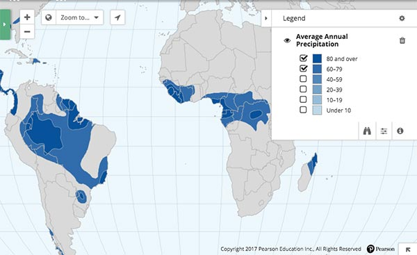  
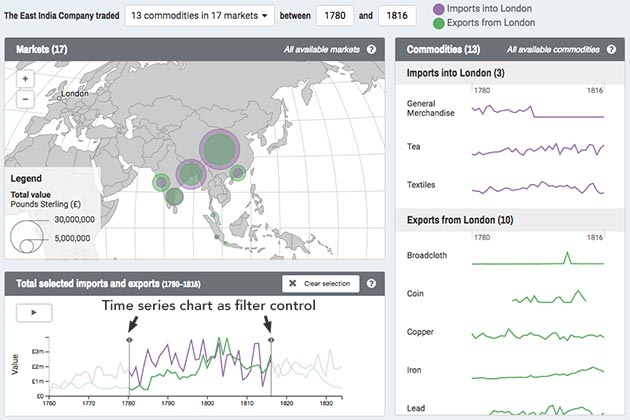  

**Make it clear that filters are active.**

Combinations of active filters can get complicated, and moreover sometimes it's easy to become engrossed in a map and forget that you're looking at a restricted set of data, so it's good to include visual reminders. This could be anything from small hints to explicit text.

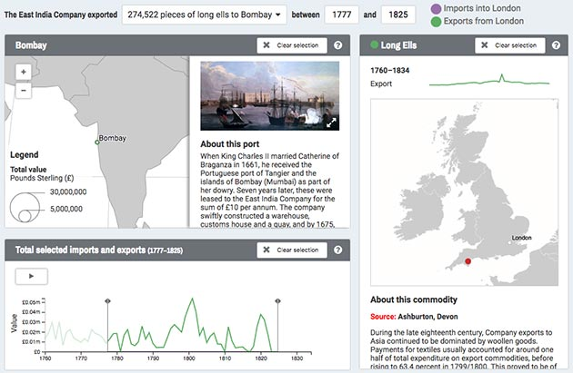  
The map and data displays have been filtered by commodity (long ells), geography (Bombay), and a time range. The title area explicitly states all this.

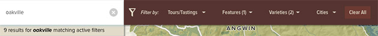  
Active filters hidden in menus are hinted at by numbers in the menu titles, showing the number of filters active within each. Note that the search results also states that results are from a restricted set of data.

**Boolean logic can be tricky.**

One challenge we run into a lot is how to deal with combinations of different filters (usually category toggles) from different places. Do we show data that matches Filter 1 AND Filter 2? Filter 1 OR Filter 2? Usually we settle on a logic of OR within a group of filters, and AND between groups, as demonstrated below. You might decide on something different, but it is always good to think this through.

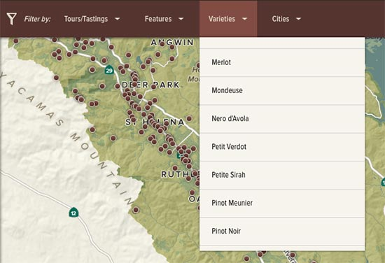  
No filters selected; all data present: 329 wineries.

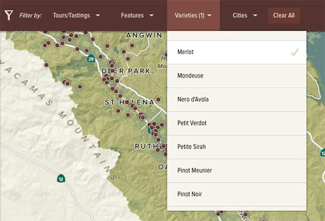  
Filter to wineries producing Merlot: 181 wineries.

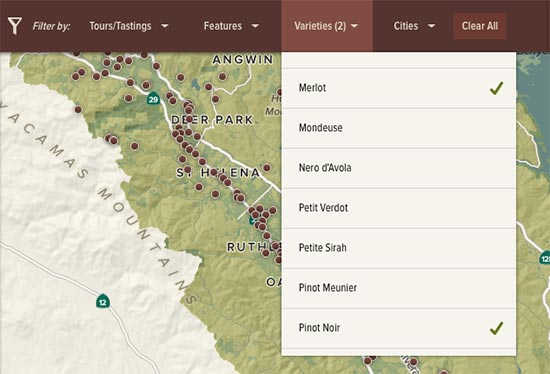  
Select a second variety; now we show wineries producing Merlot OR Pinot Noir: 210 wineries.

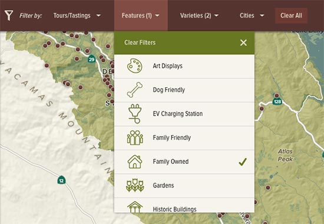  
Select a filter from the Features menu. We now show family-owned AND (Merlot OR Pinot Noir): 185 wineries.

#### Final tips on search and filter

- Don't implement these if your map exists to tell a single specific story. Allowing the reader to stray from this by needlessly searching or filtering makes the map less effective.
- Just as one can easily get lost geographically in the map, one can also get lost in complex combinations of searches and filters. Always provide easy ways to clear these and reset the map to its full, unrestricted data set.
- When possible, update the URL hash with search and filter settings as they change (and build the capability to read and apply these on initial load), so that people can copy and paste the URL to share specific views.
- Don't make search the only gateway to the map, unless you're certain that people understand the universe of data and know of something to search for. Google gets away with this because it aims for you to search _everything_ for _anything_. Your map is probably not like that. At the very least, include some examples of things to search for.

### Information retrieval

Retrieving more information than is currently visible on the map is a hallmark of interactive mapping, and can be one of the great benefits of interaction, as you can pack a lot more information into an interactive map than a static map by allowing users to get additional details on demand. To some degree, users expect this kind of behavior in an interactive map and may try to prod and click at everything, so it can be a good idea to include it even if there's not much more inforamtion to show.

**Tooltips and panels**

The result of retrieval interactions usually comes in one (or both) of two flavors: a floating tooltip (or _popup_ or _data probe_ depending whom you ask) or a fixed panel. Floating tooltips appear next to the feature on the map, usually on mouse hover (or touch, but more on that in a moment), and are best suited to relatively small amounts of information so that they don't grow huge and obscure everything. Fixed panels have dedicated space and are good for longer, more detailed information.

Besides being brief, a floating tooltip ought to show the most essential information. What's the first thing a user will want to know about something on the map? Show that so that they don't have to work hard for it. If there's a lot more beyond that, a hybrid approach works well. Show a few details on hover in a tooltip, then click for more information in a fixed panel.

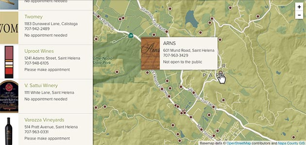  
Hovering on a point shows basic information like name and address.

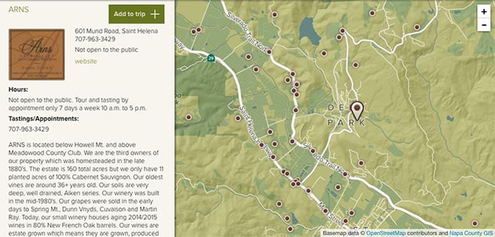  
Clicking the point opens more details in the side panel.

**Mobile is a different beast.**

Design for mobile and touch devices throws most of the above out the window and often forces us to build two totally different experiences. It's all because there is no such thing as a hover on a touch device, at least not one that's well understood. Sometimes we can replace the hover behavior with something else—say, touch-and-hold—most of the time it's abandoned with the expectation that people just want to tap on things. What's more, a phone screen doesn't have a lot of space to accommodate things floating over the map. Tapping for a fixed panel is going to be the best bet in most cases.

The two-stage retrieval can still be achieved, however, in a manner such as you've probably seen in the Google Maps app. Here's the same example as above, but for mobile. Tapping the marker shows a bit of information at the bottom. Tapping the short details brings up the full panel. (You can't see it in the screenshots, but the bottom strip initially bounces a bit to suggest that it's interactive.)

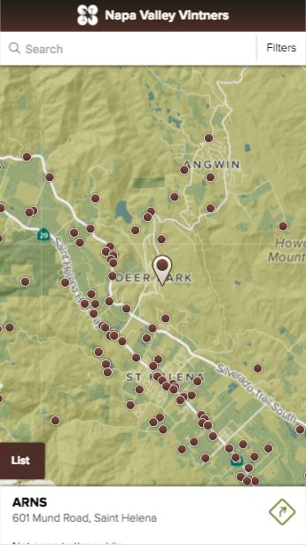  
Tap once for short, essential details.

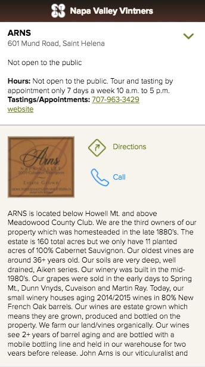  
Tap the short details for full information.

**Don't assume.**

As much as some people might be inclined to poke around at everything on the map, it's not necessarily obvious to everyone that things are interactive, or the extent to which they are. If the map has both a hover and a click interaction, for example, people might see the hover and assume that's the extent of it, not knowing to click. To that end, it doesn't hurt to include hints about what's possible. (Sometimes we have to be reminded to do this by clients who aren't accustomed to looking at interactive maps all day every day.)

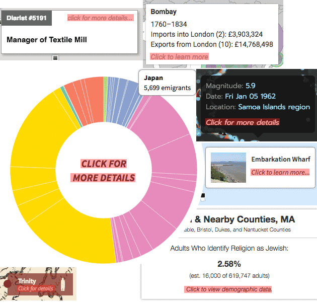 

### Data manipulation

What we loosely call "data manipulation" here refers to interactions that affect the thematic contents of the map: the data being displayed, the symbolization of it, the geographic units, etc. It's a level of interaction that only highly motivated or expert users are likely to perform, in relatively deep explorations of data. If the choice to build this is up to you, think carefully. The work may not be worth it for the small segment of people who will ever use it.

**Overlays**

Perhaps the most familiar and least costly type of "data manipulation" is adding and removing overlays. Giving user control to pile additional layers onto the map can be useful in several scenarios, such as:

- a layer enhances but is not essential to the map (e.g., the traffic layer on Google Maps)
- the map is meant for comparing two or more different things
- users will add their own data

While it can be tempting, especially to those from a GIS background, to allow all kinds of layers to be turned on an off, conservatism is advisable. Limiting the available overlays keeps people from getting too lost in the UI—and prevents some terrible-looking maps.

**Switching data sets**

The ability to change the entire basis of a thematic map is best reserved for maps meant for extensive data exploration. If it is included in a map with narrower purpose, again it is a good idea to limit the number of available views.

In a map with a rich variety of data sources, a big challenge is designing rules for symbolization and some UI elements such that they will "work" no matter what kind of data distribution is thrown at them. A few of our usual tricks for this are discussed in a presentation about "[Blindfolded Cartography](http://www.axismaps.com/blog/2015/05/blindfolded-cartography/)."

**Switching geographic units**

As so many thematic maps are subject to the [modifiable areal unit problem (MAUP)](https://en.wikipedia.org/wiki/Modifiable_areal_unit_problem), it's a rare piece of luck if data are avaialable in different enumeration units. In our experience, supporting different geographic units on the map comes either with exploratory maps of expansive data, or simply with scale changes. In the former case, switching between units is usually accomplished with basic menus or toggle buttons; in the latter case, sometimes it is coupled with zooming, as in an example earlier in this article.

Not all geographic units can be treated equally. For example, some are too small to be legible at small scales, and too cumbersome to display on screen. It may be necesary to change symbolization along with units. In the map shown below, 32,000ish zip code tabulation areas would not only be too small to see but would also bring the map to a grinding halt if displayed as polygons. We show them as points until the map is zoomed in enough to display polygons in more managable chunks.

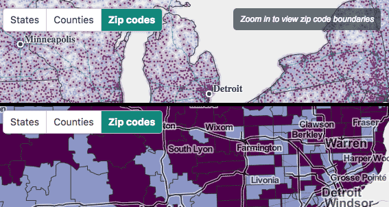  

**Customized map symbology**

A final type of data manipulation is changing how the data is presented and symbolized. Again, this is not commonly called for, perhaps most rarely of anything in this section. Unless it's requested and desired by an audience of expert users, think about how allowing a user to change, say, the choropleth classification method could ruin the story you're trying to tell. (As we know, [different classification methods can tell drastically different tales]({{site.baseurl}}/guide/data/data-classification).) Even innocuous-seeming things added for flair, like color scheme options, could be risky—a map of sequential data could end up with a diverging or categorical color scheme, for example.

Two simple recommendations here, forgoing any design details: include this stuff only if 1) you're fairly certain users want it and know what they're doing, and 2) it's a little buried in the UI, requiring motivation to find it.

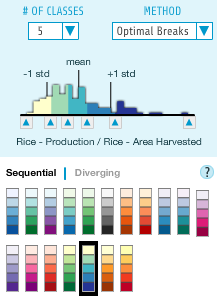  
Choropleth classification options in [indiemapper](http://indiemapper.io), a tool for completely custom cartography

### More interaction guidelines

Always be mindful of [how much interaction to add to a map]({{site.baseurl}}/guide/web/should-a-map-be-interactive/), if any at all. A good additional resource is [Robin Tolochko's master's thesis](http://tolomaps.github.io/assets/Tolochko_Thesis.pdf), which developed some guidelines for when and how to implement many of the interactions described on this page (and others), based on a study of map users and experts.