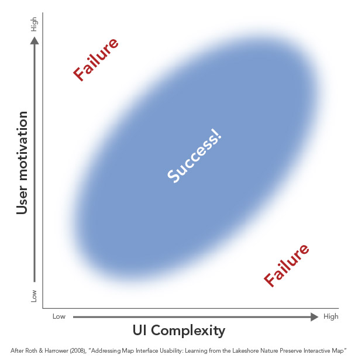
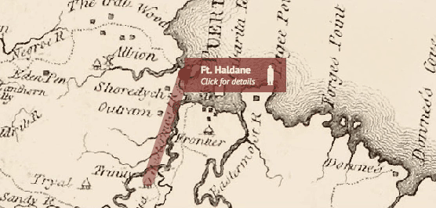
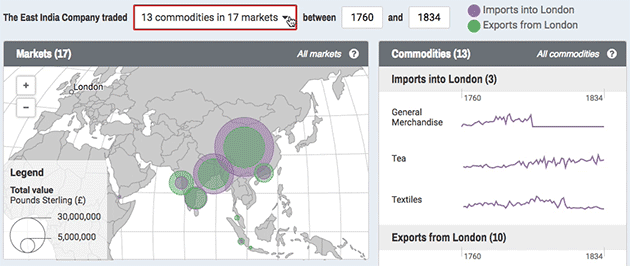
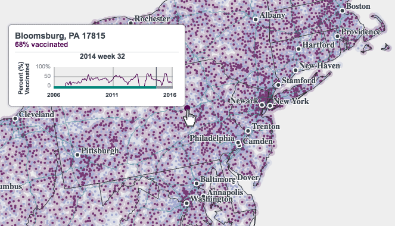
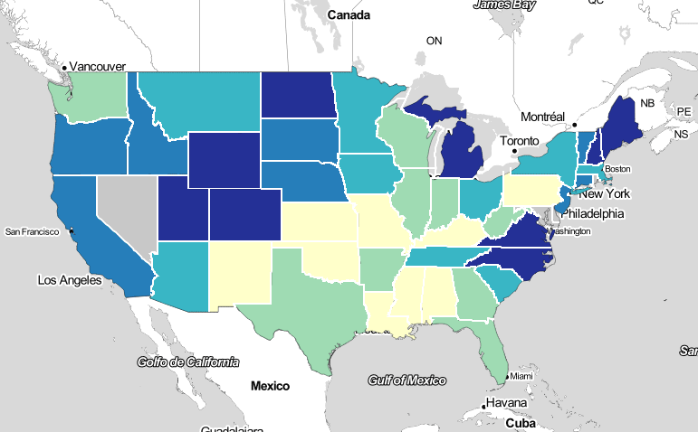
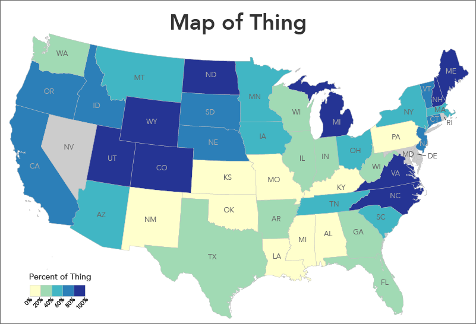
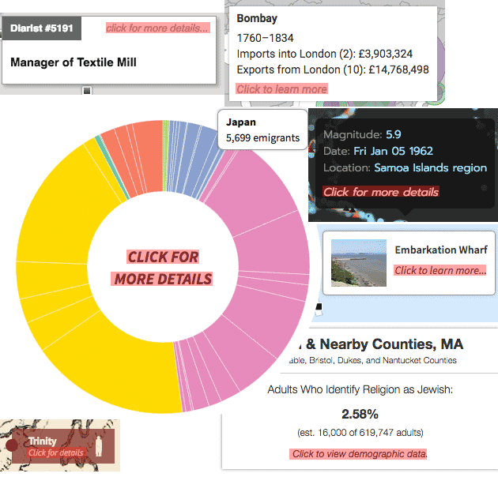

The wealth and power of digital tools makes it tempting and easy to turn every map into an interactive, but it is wise to be cautious and conservative when building interactive maps. Interactive maps are costly: in the time and effort required to produce them, in the bandwidth and performance of the sites where they live, and in the work demanded of their users.

### Know your audience

Understansing who will use your map is an important first step in deciding how richly interactive a map ought to be, if at all. Is the map for experts in its subject who will use it for deep explorations of data? Great, harness the power of interactivity and build something sophisticated! Is it for news readers who want to get a quick story? Maybe go with a couple of static maps instead. Especially with maps meant for broad public consumption, be aware that [most people probably won't interact with them](http://mapbrief.com/2017/04/06/few-interact-with-our-interactive-maps-what-can-we-do-about-it/).

More broadly speaking, the complexity of interactivity, and of the user interface, should be in line with people's motivation to use the map. An overly simplistic map is a failure for highly motivated users just as much as an overly complicated map is a failure for people with short attention spans. It's more than a one-to-one match, though: the map can support users with different levels of motivation, for example greeting people with a friendly a simply interface up front but have more complex tools and actions a bit more hidden for advanced users. [Roth and Harrower discuss this kind of support](http://www.cartographicperspectives.org/index.php/journal/article/view/cp60-roth-harrower/292) on a project we did at the University of Wisconsin; and Gregor Aisch, in a [general defense of interactive graphics](https://www.vis4.net/blog/posts/in-defense-of-interactive-graphics/), gives an interesting example of including but deliberately hiding advanced features.

### Let the map speak for itself

As a general rule, if something is important to the purpose of the map, it should be on the map without requiring user interaction. **Don't lean on interaction as a crutch to get you out of smart map design.** As much as possible, interaction should be an enhancement, not a requirement. An easy example: if you have a choropleth map, show its legend and don't hide it behind a "more info" button.

Interactive elements can also do the users' work for them. In the animated map above, which shows movement of troops, a tooltip will appear on hover but also automatically opens with some pertinent details, hiding even further detail behind a click.

In a similar vein, interactive pieces in and around the map can serve a functional purpose even if the user does not interact with them. Above, the box highlighted in red serves as a drop-down filtering control but also contains text explaining what the map is showing as the user explores it.

Besides thematic data, it's easy to forget that interactive maps need basic elements of static cartography, too. The map above contains tons of points for zip codes and yes, we can hover over them to see what and where they are, but a simple label layer and state boundaries let us orient ourselves without having to probe the map.

### When interactivity is expected

Raise your hand if you've ever done this: you're looking at a paper map on the table and absentmindedly tap it or spread two fingers across it, expecting to see a pop-up or zoom in. The ubiquity of Google Maps et al. in our lives has trained us to expect some level of interactivity in digital maps. While it's not necessarily advisable to build interactivity just because people expect it, it is at least worth managing those expectations.

If something looks interactive, it should be interactive, or else it's a frustrating tease. Take the map below, a static image. Doesn't it just *look* like a web map? (Mercator projection, choropleth plopped on top of a reference layer, etc.) It's frustrating not to be able to pan and zoom.

As a static graphic, this map would be better with a more traditional look and layout.

Conversely, if the second map were to be interactive, it would need some help. It's hard to make map elements (say, counties that you want people to click) look interactive in a way that most people will immediately understand. This is another reason not to hide anything important behind clicks and hovers: not only will people not take the time, they might never be aware that they *can* interact with the map. While we can provide some visual affordances on the map and surrounding UI, we usually fall back on explicit hints. If there's one thing most of our projects have in common, it's a phrase like "click to learn more."

Some hits from the Axis Maps catalog of interaction hints

### Alternatives to interactivity

In the end, interactivity may be the best idea for your purpose and audience, but if you have a single story to communicate to an impatient audience, there are some alternatives. Brian Timoney suggests [a few alternatives to interactive maps](http://mapbrief.com/2017/04/06/few-interact-with-our-interactive-maps-what-can-we-do-about-it/) for the look-but-don't-touch crowd, among them small multiples and animated GIFs. These are both ways to present your map as several different views, without the reader having to click anything. Similarly, so-called ["scrollytelling"](http://vallandingham.me/scroll_talk/) has become a popular way to present graphical pieces, and is elevated to an artform by some of the major news outlets. These are pieces in which the map (or some other graphic) is embedded in the page, often with a text story, such that scrolling the page changes or advances the state of the map in some way. The idea is that readers are comfortable and willing to scroll down a page much more than they to click things.