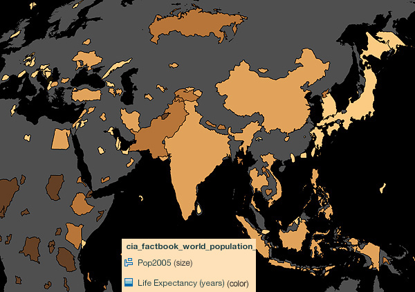

### When to Use

Single-theme (univariate) [area cartograms](../articles/cartograms.html), also known as value-by-area maps, are a popular and elegant want to encode thematic data into the base map. Because no colors are used, a second theme (bivariate) map can be made very easily by adding choropleth-like fills to each enumeration unit. In the example map below, the size of each country is drawn directly proportional to the population of the country; the fill color tells us about life expectancy (darker = short life expectancy). [See here](../articles/cartograms.html) for a longer discussion on the pros and cons of non-contiguous area cartograms.

###Example Map

This bivariate non-contiguous area cartogram scales the size of the countries based on their population: populous countries like India and Japan become much larger, while sparsely-populated countries like Somalia and Mongolia shrink in size. The fill colors show life expectancy: the darker the color, the shorter the life expectancy. In other words, this map combines a traditional single-theme [choropleth map](../articles/choropleth.html) (the colors) with a traditional single-theme [non-contiguous area cartogram](../articles/cartograms.html) (the sizes) to create a hybrid map of both. Since the shapes of the countries have not been distorted and they remain in relatively the correct position on the globe, they should remain easy to recognize even with the size changes. Leaving the original gray outlines of the continents behinds provides a visual comparison between the geography we are familiar with, and the world as it would be if redrawn based on population.

