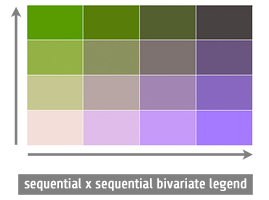

### When to Use

Bivariate choropleth maps combine two datasets (usually numerical data) into a single map allowing us to show relatively how much of X (variable 1) and Y (variable 2) exist in each enumeration unit. They inherent many of the same strengths and weaknesses as univariate choropleth maps, which are outlined [here](../articles/choropleth.html). Like all bivariate maps, these maps encode two numbers/facts per location and are, therefore, graphically efficient.

### Concerns

All other things being equal, bivariate choropleth maps are more difficult to read than univariate choropleth maps because they simply contain more colors. A 4-class univariate choropleth map has 4 colors whereas a 4-class x 4-class bivariate map has 16 colors, which is many more colors than we'd recommend putting on a univariate map (8 or 9 classes in an oft-cited upper limit). Having 16 different shades of color on the map makes it more challenging to reliably discriminate each color, especially on complex maps due to [simultaneous contrast](http://en.wikipedia.org/wiki/Contrast_effect). That is not to say it is impossible, especially if using well-designed color schemes. Many elegant and effect bivariate choropleth maps exist, but be aware that the more general your audience—and the less time folks spending reading it—the more you may want to default to a simpler univariate map.

### Example Map

This is a 3-class x 3-class bivariate choropleth map from [indiemapper](http://indiemapper.com) that uses a diverging x diverging scheme (more here about [color schemes](../articles/color_schemes.html). Below that is a scatterplot which allows you to see the numerical distribution of your observations and make informed decisions about how to best classify your data (more here about [data classification](../articles/classification.html). Just like a histogram for single-variable maps, a scatterplot is a useful tool for devising classification schemes for bivariate choropleth maps.

### Diverging Versus Sequential Color Ramps

There are two kinds of bivariate choropleth color schemes: **diverging x diverging**, and **sequential x sequential**. Both should be used with either numerical data or with rankable categorical data. With sequential, colors simply go from light to dark across the color ramp; it is cartographic convention that "darker = more" so that the larger numbers attach to the darker colors, although if your map is going to be displayed against a dark background, that rule is inverted (it is the "high contrast" colors, against the background, that are the most easily seen and stand-out).

Diverging schemes, whether for a single-theme map or a bivariate map, should only be used if there is a meaningful midpoint and you want to highlight how places _diverge_ away from that break point. For example, a map with both positive and negative numbers could place zero as the middle class (or break point), making it easier to see places that are going up or down. Another example would be 50% of the vote in a 2-party election: colors would get darker/stronger in both directions are we move away from that natural break point of 50% (a tied vote).

For some good example color schemes and a useful—as well as very practical—discussion on bivariate choropleth maps, take a look at this [article by Josh Stevens](http://www.joshuastevens.net/cartography/make-a-bivariate-choropleth-map/).