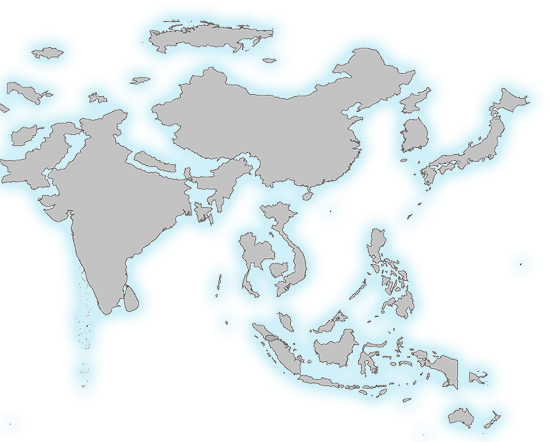
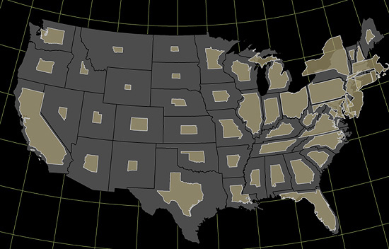

### When to Use

Area cartograms have enjoyed a **noticeable increase in popularity** in recent years and are often seen as a natural alternative to the more traditional [choropleth map](../articles/choropleth.html). Despite this surge of popularity, area cartograms—also known as _**value-by-area maps**_—are not without some serious limitations and their use is often more for their theatrical value (i.e., to grab the attention of an audience) and less for their ability to help folks understand subtle details of geographic datasets. Nonetheless, area cartograms are perhaps the single most efficient way to encode thematic data attached to enumeration units (e.g., counties, states) since the base map performs double duty as both the geography AND the thematic attribute: The size of each enumeration unit is scaled proportionally to the data value attached to that location. This leaves plenty of room for other thematic data, and area cartograms can be paired nicely with other map types to create rich, multivariate maps.

In the example above, the area of these countries has been scaled according to their population. Notice how, Australia which has a large landmass but a relatively small population, has shrunk dramatically compared to India or China. Area cartograms are most often used when mapping data about people, although any numerical data attached to enumeration units can be used.

Cartograms may be generated by a variety of algorithms (or by hand!) and may be **contiguous**, where sizes are distorted but units remain attached to their neighbors, or **non-contiguous**, where individual units are are arranged in an approximately geographically correct way but are spaced apart, as above. We prefer non-contiguous cartograms for their ability to preserve familiar shapes, but all cartograms must sacrifice shape preservation, topology preservation, or both. For a more detailed look at cartogram design, see [Zach Johnson's work](http://indiemaps.com/blog/2008/04/cartogram-design/).

### Classed versus Unclassed Area Cartograms

A variation on traditional cartograms is the **_classed area cartogram_**. In a traditional area cartogram, the data are not grouped into classes and thus the size of places is scaled directly (and continuously). In a classed cartogram, the data are first grouped into classes (e.g., 0-10, 11-20, 21-30, ...) and then discrete areal sizes are assigned to each of those classes (see [here](../articles/choropleth.html) and [here](../articles/proportional_symbols.html) for a fuller discussion of the pros and cons of data classification). Classed cartograms could potentially make it easier to compare the relative size of places since the differences in size are large and there are only a handful of sizes on the map. For example, although two countries may have different shapes, in a classed cartogram they'd have the same area if they were in the same data class. See more of [Zach Johnson's work](http://indiemaps.com/blog/2009/10/classed-cartograms/) for a discussion of this idea.

### Limitation #1
When size disparities are large (as in the population map above), area cartograms can powerfully juxtapose our mental maps of the world with the intentionally-distorted map before us. This, however, exposes a major weakness of area cartograms: If the reader isn't familiar with what the areas _should look like_, they won't be surprised by intentional distortions since they have no mental map to judge them against.

**Potential Solution:** Display a traditional base map underneath your area cartogram pieces so map readers can judge how different the cartogram units are from their original size.

### Limitation #2

We know from extensive testing that most people do not estimate the size of areas very well and can struggle to estimate the differences in size between map symbols beyond a crude "larger" or "smaller" ballpark estimate. Thus, area cartograms share this same problem with proportional/graduated symbol maps, although there is reason to believe we do even worse with cartograms because each piece on the map is a unique, complex shape. In fact, even when two enumeration units are the same area but different shapes, people often assume they are different areas. Given that the data are encoded directly in the sizes, **this inability to judge sizes well is going to make it hard for people to understand your data**.

**Potential Solution:** Although we haven't done formal testing, based on insights from graduated symbol maps, classed area cartograms might make it easier for folks to know two places are similar in size.

**Not sure you should use an area cartogram?** Good alternatives in indiemapper include [dot density maps](../articles/dot_density.html), [graduated/proportional symbol](../articles/proportional_symbols.html) maps, and [choropleth.](../articles/choropleth.html)

### Our Recommendations

We use cartogram primarily when we have data that show strong and unexpected size disparities among locations—small places become large, large places, small. Such maps, especially when related to people (e.g., population, wealth, consumption habits), can be very engaging and might be more memorable than other map types. Note, however, that folks might reject your map as "wrong" because they don't appreciate that the distortions in size are deliberate. Even if they do appreciate that, they'll most likely have a hard time estimating areas and extracting numbers from the map.