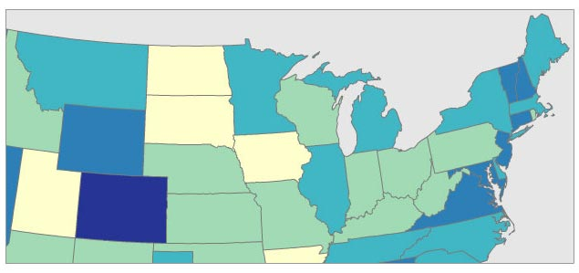
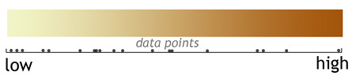
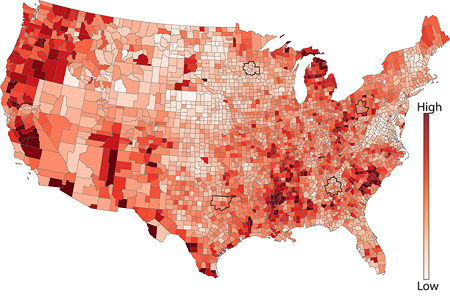

### When to Use

You can use a choropleth maps when your data are **(1)** attached to enumeration units (e.g., counties, provinces, countries), **(2)** [standardized to show rates or ratios](../articles/standardize.html) (never use choropleth with raw data/counts), and **(3)** you have a continuous statistical surface, in other words, you could conceptually measure the phenomena anywhere in space (n.b. 'zero' is still a valid measurement). For example, _number of people_ is a count and not appropriate for choropleth maps; _number of people per square mile_ is a ratio and is a continuous statistical surface (even if it drops to zero over uninhabited places, every location has a data value) and, thus, is appropriate for choropleth maps.

Example datasets appropriate for choropleth maps:

*   world map of income tax rates by country
*   map showing number of births per 100,000 in 2009, reported by U.S. county
*   map showing the percentage change in skin cancer from 1990 to 2010 by Australian state.
*   world map of percentage of population under 18 years old, reported by country
*   map showing the percentage increase in home value from 1980 to 1990 by Canadian province

### Background

Choropleth maps are extremely popular, probably the most common thematic map in use today. That's good because it means your audience is likely to understand them. One reason they're popular is that much of our geodata is reported by enumeration units, such as census data, and so we are accustomed to thinking of the world as divided into spatial units like census tracts, counties, and provinces. However, most cartographers would argue choropleth maps are over-used and commonly misused if the geographic phenomena being mapped aren't intrinsically tied to enumeration units: For example, communicable diseases, soil types, or age demographics don't care much about county lines or zip codes and rarely do they change abruptly at those human-created boundaries. By comparison, tax rates are very closely tied to enumeration units, do change abruptly, and make perfect sense as a choropleth map. The less the thing you are mapping is tied to enumeration units, the less sense a choropleth map makes.

_**Not sure you should use a choropleth map?**_ Good alternatives include [dot density maps](../articles/dot_density.html), [graduated/proportional symbol](../articles/proportional_symbols.html) maps, and [cartograms](../articles/cartograms.html): Furthermore, while choropleth maps require that your data are standardized (rates, ratios...e.g., _X per square kilometer_ or _Y per 100,000 people_), these other 3 map types can all handle raw data (e.g., simple counts, totals).

### Example Classed Choropleth Map

Below is a 5-class choropleth map that uses a [sequential color scheme](../articles/color_schemes.html) (from light to dark) attached to an equal-interval classification scheme.

With sequential color schemes, it is traditional to use darker/stronger colors for larger numbers. Note that the appearance of the choropleth colors will appear to change depending on what other colors are used on the map, such as blue water or black city labels. The colors of the enumeration unit borders (county and state lines here) also have a very large impact on the look of the map, so experiment with both fill and stroke color combinations. You may even decide to not draw those enumeration unit borders (no stroke, just fill). Note: it may be harder for your audience to locate places on the map without those borders. For a more complete discussion of color in thematic mapping, have a look [ColorBrewer](http://colorbrewer2.org).

### Number of Data Classes

If you want to be safe, make a map with **3–7 data classes**. Of course, your goals and data should also play into this decision: For example, political maps in the United States often have only 2 classes (the well-known red state / blue state maps) or a map that wants to simply highlight places above and below a national average.

The more classes you use, the less data generalization (which is good), but this comes at the expense of legibility and the associated risk of map reading errors since more colors are harder to see and print reliably (which is bad). The key question is _how much generalization do you want?_ A map with 3 classes/colors (e.g., low, medium, high) will be easy to see and remember, but may gloss over some very important aspects of the data and create artificial geographic patterns by lumping together many places that are in fact quite different. There is no ideal number of classes for a map, so experiment.

Not sure how many classes to use? Have a look at the distribution of your data in a histogram (see examples below): Are there obvious clusters within your data? Are there large gaps in your data range that suggest nice compact data classes? If so, pick that number of classes and place those class breaks around those clusters.

### Classification Method

Just as there is no single correct number of classes, there is no single best way to classify you data into ranges. Look at a histogram (or scatterplot) to determine the 'form' of your observations. Above all else the goal of data classification is to put places with similar rates in the same class, and separate places with very different rates into different classes.

_The form of this histogram suggests that 3 or 4 data classes seem most appropriate.
 Lacking any other insight, the "dips/gaps" suggest natural places to break the data._

> **EQUAL INTERVAL** divides the data into equal size classes (e.g., 0-10, 10-20, 20-30, etc.) and works best on data that is generally spread across the entire range. **CAUTION:** Avoid equal interval if your data are skewed to one end or if you have one or two really large outlier values. Outliers in that case will likely produce empty classes, wasting perfectly good classes with no observations in them. Since the hotel data above doesn't have really large outliers, this is a data distribution that works well with equal interval.
> 
> **QUANTILES** will create attractive maps that place an equal number of observations in each class: If you have 30 counties and 6 data classes, you'll have 5 counties in each class. The problem with quantiles is that you can end up with classes that have very different numerical ranges (e.g., 1-4, 4-9, 9-250...the last class is huge). Quantiles can also separate locations with very similar rates and group together places that have very different rates, which is very undesirable, so use the histogram to see if this is happening. **CAUTION:** In the hotel room example above, the quantile produced a questionable class break by lumping a portion of the third cluster back into class 2, despite it being much closer (numerically) to the other observations in class
> 
> **NATURAL BREAKS** is a kind of "optimal" classification scheme that finds class breaks that (for a given number of classes) will minimize within-class variance and maximize between-class differences. One drawback of this approach is each dataset generates a unique classification solution, and if you need to make comparison across maps, such as in an atlas or a series (e.g., one map each for 1980, 1990, 2000) you might want to use a single scheme that can be applied across all of the maps.
> 
> **MANUAL** There are many times we need to manually set one or all of the class breaks. For example; Are there important break points that need to be "hardwired" into your class breaks? Does one of the class breaks need to be the mean? Is this map part of a series that needs the same classes across all of the maps (so that the colors always refer to the same numbers on any map)? Do any of the other methods get you close to a good solution that could be improved with a few slight adjustments those classes? If so, do not hesitate to set these class breaks yourself.

### Unclassed Choropleth Maps

Unclassed choropleth maps are an attractive alternative to traditional classed choropleth maps, although their merits have been hotly debated within cartography and 30+ years of testing has revealed both their strengths and weaknesses. First proposed by [Waldo Tobler](http://en.wikipedia.org/wiki/Waldo_R._Tobler) in the early 1970s, proponents of these maps like that they avoid the messy (and nearly always imperfect) problem of having to lump our data into classes (e.g., 0-10, 11-20, .21-30, ...). Critics of traditional, classed choropleth maps say that data classification is a very powerful form of data filtering that drowns out important details on the map, is easily abused to change what the map says, and is often taken for granted by map readers. Unclassed maps side-step this problem by "letting the data speak for itself" and allowing even subtle differences between places to emerge as subtle differences in color.

With unclassed choropleth maps, each unique data value gets a unique color: For example, the unemployment figures for the 50 US states would be ranked from lowest to highest and placed along a continuous color ramp from low to high (see below). If, for example, there is a big numerical gap/jump from the state with the 3rd highest unemployment to the one with the 2nd, there'd be a correspondingly larger jump in color - the data are arranged proportionally along the color ramp.

### Example Unclassed Choropleth Map

In the map below, notice how you can easily see a large geographic pattern of unemployment rates, but it is very hard to compare or rank counties: try to accurately arrange the counties in California from lowest to highest...it's nearly impossible.

### Limitations

There are at least three major drawbacks with unclassed choropleth maps. First, while the idea of letting our data speak for itself is appealing we often find it has too much to say. Cartographers have long relied on classification to suppress random noise or insignificant variations to highlight large, major differences. For example, a very simple 2-class map of unemployment (using only 2 colors) would quickly show whether a place is above or below the national average; more detail than that might be unnecessary. Second, extensive, careful user testing has shown that people have a very hard time matching colors on unclassed maps with colors in the legend since they may contain hundreds of subtly different colors that are easily confused with each other. This makes it very hard to estimate values or get specific numbers from the map (e.g., Is Belgium slightly darker or lighter than Syria?). Third, unclassed maps with their many subtly different colors often print very poorly, especially on low-end printers. Although the map may use 50 different shades of red, your printer (and possibly even your monitor) aren't up to that task. Sadly, thanks to [simultaneous contrast](http://en.wikipedia.org/wiki/Contrast_effect), neither are your eyes.

### Our Recommendations Unclassed Choropleth

We use unclassed choropleth maps whenever we want a less filtered view of our data, when we can't find a good classification scheme that does the data justice, and/or when we're making the map specifically to highlight overall geographic patterns. However, we don't use them if it is critical that folks be able to "get numbers off the map" or very carefully compare one location to another. If people need to get numbers off the map and your map is static/printed preventing people from clicking on it to retrieve rates (as they might on an interactive map), you might be better off using a classed choropleth map.

### Our Recommendations Classed Choropleth

We use classed choropleth maps when we have data attached to enumeration units and want to show both overall geographic patterns and to make it relatively easy on our map readers to extract specific data rates from the map. While classification introduces subjectivity to our work (e.g., since there is no single best number of classes or way to create those classes) and eliminates some details because it groups data into classes, classed choropleth maps are nonetheless a very popular and reliable way to represent the world.