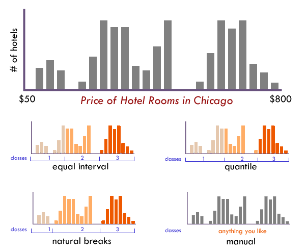

### When to Use

If you are going to classify your data you must decide both **the number of classes** and **the method** for breaking your data into ranges. The are many ways to **systematically classify data**. What follows is a discussion of those classification methods and their relative merits.

The point of classification is to take a large number of observations and **group them into data ranges or classes**. Why? Map readers often find a few well-defined classes are easier to understand than raw data since, if done well, they help to simplify and clarify the message of the map. Data classification, however, is not without some challenges and it is often difficult to find an "ideal" method for a given dataset. It is always wise to have an understanding of the data you are working with before blindly applying a "favorite" classification method, which may create false patterns on your map that bear little resemblance to the actual geographic phenomena you are trying to portray. Maps that use questionable classification methods are more than ineffective, they're misleading.

Classification matters because how we group our data into classes is one of the most fundamental aspects of map generalization—the process by which we simplify the real world to fit it on to the page—and small differences in how we do that **can dramatically change the look of the map, and thus, its message**. Despite this influence, data classification is often taken for granted by map readers since we rarely notice or question the classes that are used in maps, and thus, it is one of the easiest ways to "[lie with maps](http://www.amazon.com/How-Lie-Maps-Mark-Monmonier/dp/0226534219)"—whether intentionally or accidentally. Nonetheless, classification is a useful and basic part of making thematic maps.

_This map uses a 5-class equal interval classification scheme (1-10, 11-20, ...)._

**NOTE:** This discussion applies to anyone making [Choropleth Maps](../articles/choropleth.html), [Graduated Symbol Maps](../articles/proportional_symbols.html) or [Cartograms](../articles/cartogram.html) since you can make either classed or unclassed versions of those maps.

### The Goal of Data Classification

Generally speaking, a basic goal of a classification scheme is to group together similar observations and split apart observations that are substantially different. In more technical terms, the goal is to find the optimal number of classes—and where to put the breaks between those classes—so as to minimize within-group variance and maximize between-group differences. For example, if I had a data set with 4 observations of 1.3, 1.6, 3.5 and 3.9 many folks would be inclined to split those observations into 2 groups with 1.3 and 1.6 in the first group and 3.5 and 3.9 in the second because that pairing makes sense given the large numerical gap in the middle of the data range. Such an approach is common and is called "maximum breaks."

However, there are often other considerations when classifying our data and simply maximizing between group differences may not be the primary goal: In the example above, it might be possible that 1.5 is a **critical value** and all that matters is to distinguish between locations above and below that critical break point (e.g., if a location has a reading below 1.5 they might be eligible for emergency funding). In this case, external constraints over-ride our mathematical solutions and despite being fairly close together 1.3 and 1.6 would now be placed in different classes since they straddle that breakpoint.

### Number of Data Classes

If you want to be safe, make a map with **3–7 data classes**. Of course, your goals and data should also play into this decision: For example, political maps in the United States often have only 2 classes (the well-known red state / blue state maps) or a map that wants to simply highlight places above and below a national average.

The more classes you use, the less data generalization (which is good), but this comes at the expense of legibility and the associated risk of map reading errors since more colors are harder to see and print reliably (which is bad). The key question is _how much generalization do you want?_ A map with 3 classes/colors (e.g., low, medium, high) will be easy to see and remember, but may gloss over some very important aspects of the data and create artificial geographic patterns by lumping together many places that are in fact quite different. There is no ideal number of classes for a map, so experiment.

Not sure how many classes to use? Have a look at the distribution of your data in a histogram (see examples below): Are there obvious clusters within your data? Are there large gaps in your data range that suggest nice compact data classes? If so, pick that number of classes and place those class breaks around those clusters.

### Classification Method

Just as there is no single correct number of classes, there is no single best way to classify you data into ranges. Look at a histogram (or scatterplot) to determine the 'form' of your observations. Above all else the goal of data classification is to put places with similar rates in the same class, and separate places with very different rates into different classes.

_The form of this histogram suggests that 3 or 4 data classes seem most appropriate.
 Lacking any other insight, the "dips/gaps" suggest natural places to break the data._

> **EQUAL INTERVAL** divides the data into equal size classes (e.g., 0-10, 10-20, 20-30, etc.) and works best on data that is generally spread across the entire range. **CAUTION:** Avoid equal interval if your data are skewed to one end or if you have one or two really large outlier values. Outliers in that case will likely produce empty classes, wasting perfectly good classes with no observations in them. Since the hotel data above doesn't have really large outliers, this is a data distribution that works well with equal interval.
> 
> **QUANTILES** will create attractive maps that place an equal number of observations in each class: If you have 30 counties and 6 data classes, you'll have 5 counties in each class. The problem with quantiles is that you can end up with classes that have very different numerical ranges (e.g., 1-4, 4-9, 9-250...the last class is huge). Quantiles can also separate locations with very similar rates and group together places that have very different rates, which is very undesirable, so use the histogram to see if this is happening. **CAUTION:** In the hotel room example above, the quantile produced a questionable class break by lumping a portion of the third cluster back into class 2, despite it being much closer (numerically) to the other observations in class
> 
> **NATURAL BREAKS** is a kind of "optimal" classification scheme that finds class breaks that (for a given number of classes) will minimize within-class variance and maximize between-class differences. One drawback of this approach is each dataset generates a unique classification solution, and if you need to make comparison across maps, such as in an atlas or a series (e.g., one map each for 1980, 1990, 2000) you might want to use a single scheme that can be applied across all of the maps.
> 
> **MANUAL** There are many times we need to manually set one or all of the class breaks. For example; Are there important break points that need to be "hardwired" into your class breaks? Does one of the class breaks need to be the mean? Is this map part of a series that needs the same classes across all of the maps (so that the colors always refer to the same numbers on any map)? Do any of the other methods get you close to a good solution that could be improved with a few slight adjustments those classes? If so, do not hesitate to set these class breaks yourself.