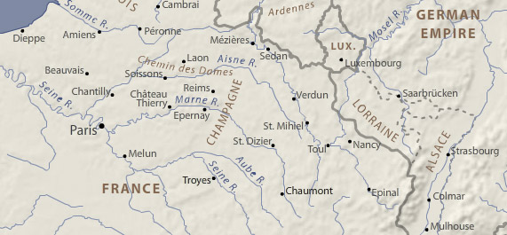
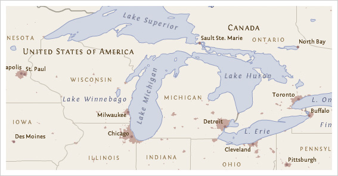
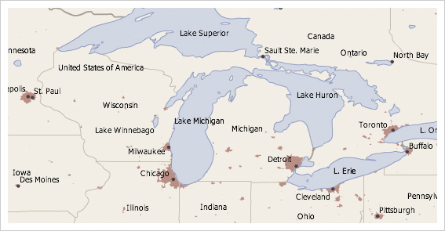

### Background

The default thinking tends to be that labels and text on the map are for naming geographic features. While this is extremely important, they function in a number of other valuable ways, too. For example, **labels** also confirm the locations of features, reflect their character and shape, indicate relationships between them, and symbolize data associated with them. **Text**, in the form of short blocks or descriptions, is used for essential elements of map design like title, data sources, projection, and scale, as well as to provide an explanation about what a map is showing. Because of their prevalence (especially on reference maps) and tendency to compete for attention with other map symbols, labels and text make also make a strong aesthetic impression on the map reader and contribute to its overall 'look and feel'. Although every map is different, labels and text deepen our understanding of a place in ways that other graphical elements (like color) cannot.

The task of **1) selecting fonts** and font styles and **2) placing (or, positioning)** labels and text on the map is traditionally called "map lettering". Selection has to do with choosing fonts and font styles, whereas placement has to do with establishing relationships between labels and geographical features. They both have a great influence on how well a map functions as a whole. Given its complex and iterative nature (e.g., moving a label or changing a font often creates a domino effect of other necessary lettering changes), lettering has historically been one of the most time-consuming components of mapmaking, despite great advances in automating the process.

### Important Questions to Ask Before Lettering a Map

**1) What is the intellectual hierarchy of the features I want to label?** Intellectual hierarchy has to do with ranking your map features in order of their importance. For example, on some maps capital cities might be considered more important than mid-sized cities, which in turn might be more important than small cities. States and countries might be higher than all types of cities in the intellectual hierarchy. This kind of conceptual ranking can help you begin to create a visual hierarchy of map labels and text.

**2) Why do I need a visual hierarchy of map labels and text?** A visual hierarchy is an essential aspect of map design that helps map readers organize graphical information so that it can be understood more quickly and easily. When applied to labels and text, a visual hierarchy allows people to more quickly and easily execute basic map reading tasks like categorizing, grouping, searching and scanning for information. The first map below shows a visual hierarchy of labels. Without visual hierarchy, as shown in the second example below, map reading becomes more taxing because everything is assigned an equal level of importance.

All else equal, bigger and bolder styles tend to promote labels and text in the visual hierarchy. Capitalization and bold colors like black, red, or purple can have a similar, promoting effect. Smaller point sizes and letterspacing (or, tracking) tend to demote labels, as do more muted text colors, like gray. Of course, the task becomes more complex as more labels are added and the number of necessary styles increases. Creating a good visual hierarchy will normally require some experimentation, revision, and refinement.

**3) What are the basic map lettering conventions I should be aware of?** There is no shortage of map lettering conventions for placing and styling text on the map. While conventions are a great starting place, they should not be taken as rules that cannot be broken. A few of the more common conventions include:

*   Prioritize the position of point feature labels: 1) above and to the right, then 2) below and to the right, then 3) above and to the left, then 4) below and to the left. Positioning directly above, below, or to the sides is not preferred.
*   Visually center and increase the letter-spacing of labels within area features to reinforce their size/shape.
*   Use uppercase to label area features.
*   Categorize cultural and physical features using sans serif and serif fonts.
*   Label water features blue and in an italic font.
*   Distinguish ranked categories by at least two points when label sizes are small.
*   Don't rotate labels upside-down.
*   Labels should not be smaller than around 6-7pts for print maps / 9-10pts for maps displayed on screen.
*   If necessary, use one serif and one sans serif font, but don't use more than one sans serif font on the map.

**4) What is the overall map 'look and feel' that I want to convey?** Establishing a 'look and feel' has a lot to do with knowing the audience and purpose of the map. If the map has an overriding theme, this can also play a role. All fonts have "personalities" that can make a subjective impression on the map reader. Choose fonts that do not call undue attention to themselves (nothing too elaborate), yet whose personalities support the map's main purpose and theme. For example, choices can help make maps look and feel formal, informal, historical, modern, etc.

**5) What is the end-use display environment for my map?** The display environment is a huge factor in determining whether your lettering choices will be legible to the map reader. This includes considering how the map will be reproduced (e.g., laser printer, photocopier, scanner, fax machine, HDTV screen, projection screen, or mobile device?), as well as other factors such as viewing distance and lighting conditions. As a general rule, coarse resolutions, lossy or low-quality reproduction methods, low light and long distance reading all tend to require larger, more robust fonts with thicker strokes to remain legible.

**6) How much map lettering do I really need?** There is no easy answer to this question. Generally speaking, add enough to support the purpose of the map and provide some contextual information where this could be beneficial without cluttering the map or otherwise distracting from its use. General reference maps tend to include a wide range of densely spaced labels. Thematic maps, on the other hand, are often less densely labeled, using graphic symbols and colors and explanatory text to communicate their main message instead. It is also worth considering the "evenness" of text across the map. Distinct areas of high and low label density can make a map appear unbalanced. Overall, it's easy to add labels and text to the map, more difficult to determine how much is appropriate.

**7) Do I need to know anything about typography? Yes.** Knowing a little bit about fonts, letterforms and their component parts can go a long way in helping to make the best choices for your map.

> **Point Size** is the height of a capital letter plus some space above and below. This is a holdover from the days of metal type setting, in which the characters in a font had to fit on a slug of the same body size to ensure uniform printing. _It's important to note that different typefaces at the same point size can appear different in size, as shown below._ _Point size alone should never be used to determine legibility._
> 
> 
> 
> **X-height** is the height of a lowercase letter minus its ascenders and descenders, shown with a blue dashed line in the example above. This property is nearly as important as point size when considering the legibility of text. All else equal, when point size gets small, fonts with larger x-heights tend to appear bigger than those with small x-heights. Fonts with largish x-heights also tend to have bigger interior spaces within letterforms that are less likely to collapse on screen at small sizes.
> 
> **Serifs** are the small marks that appear on the terminals of some letterforms, as shown below on the letter 'T'. Fonts for screen-based maps should have robust serifs that won't break down at small sizes. In fact, at small sizes on screen, the best choice is usually a sans serif font. However, when serifs are an option on screen, heavier block-like or square serifs are often the best choice, like those on the fonts Georgia, Droid Serif, or Bitstream Vera Serif.
> 
> 
> 
> **Depth of Family.** Font families that have a range of members are often good choices, given the variety of font styles regularly employed on maps. If a font comes in a regular, or Roman, weight, plus an italic and bold style, you'll be able to cover the common uses for these without having to introduce another font family. Some font families, like Helvetica Neue, are very 'deep' and can include 10 or more members.
> 
> **Cost.** Most of the time, good fonts cost money and require a license to use. _Good typography is worth paying for!_ Don't expect to find many freebie font families out there that look great across a range of sizes, work well in print and on screen, include a full set of glyphs, support multiple languages, contain a variety of members, and are otherwise suitable for mapping. That said, there are many decent free fonts out there through things like [Google Fonts](https://www.google.com/fonts).

### Suggested fonts

Below are a few of our go-to fonts. Some of these are better for web map user interfaces, some are better for map labeling, and some could be used for both. Note the condensed and narrow families, which can be useful for labeling. Also note the few families that have both a serif and sans serif counterpart, which can be handy for a fully unified look (e.g., map labels and body copy). Most have at least the four basic variants (regular, bold, italic, bold italic), some many more. Most are free on [Google Fonts](https://www.google.com/fonts), but some are on [Typekit](https://typekit.com/) or are paid.

#### Sans serif:

* [Open Sans](https://www.google.com/fonts/specimen/Open+Sans) and [Open Sans Condensed](https://www.google.com/fonts/specimen/Open+Sans+Condensed) (Google Fonts)
* [Source Sans Pro](https://www.google.com/fonts/specimen/Source+Sans+Pro) (Google Fonts)
* [PT Sans](https://www.google.com/fonts/specimen/PT+Sans) and [PT Sans Narrow](https://www.google.com/fonts/specimen/PT+Sans+Narrow) (Google Fonts)
* [Myriad Pro and Myriad Web Pro](https://typekit.com/fonts/myriad-pro) (Paid, Typekit)
* [Ubuntu](https://www.google.com/fonts/specimen/Ubuntu) and [Ubuntu Condensed](https://www.google.com/fonts/specimen/Ubuntu+Condensed) (Google Fonts)
* Arial and Arial Narrow (Paid but almost definitely on your computer already)
* [Proxima Nova](https://typekit.com/fonts/proxima-nova) and [Proxima Nova Condensed](https://typekit.com/fonts/proxima-nova-condensed) (Paid, Typekit)
* [Oswald](https://www.google.com/fonts/specimen/Oswald) (Google Fonts)
* [Merriweather Sans](https://www.google.com/fonts/specimen/Merriweather+Sans) (Google Fonts)
* [Fira Sans](https://www.google.com/fonts/specimen/Fira+Sans) (Google Fonts)

#### Serif:

* [Source Serif Pro](https://github.com/adobe-fonts/source-serif-pro) (Google Fonts)
* [PT Serif](https://www.google.com/fonts/specimen/PT+Serif) (Google Fonts)
* [Merriweather](https://www.google.com/fonts/specimen/Merriweather) (Google Fonts)
* [Aver](http://www.dafont.com/aver.font) (Free)
* [Lora](https://www.google.com/fonts/specimen/Lora) (Google Fonts)
* [Latienne Pro](https://typekit.com/fonts/latienne-pro) (Paid, Typekit)
* [IM Fell](http://www.dafont.com/im-fell-types.font) Great Primer and others (Google Fonts)

#### Monospace:

* [Fira Mono](https://www.google.com/fonts/specimen/Fira+Mono) (Google Fonts)

#### Symbol:

* [Font Awesome](http://fortawesome.github.io/Font-Awesome/) (Free)