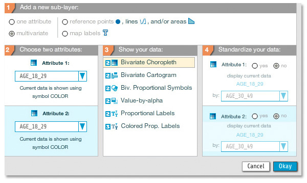

### One Data Theme or Many Data Themes?

If you want to make a thematic map you need to be working with geographic data that has associated thematic attributes. "Thematic attributes" can be any data associated with specific locations/places such as _life expectancy_, _voting habits_, _land use categories_, _crime rates_, _housing prices_, _locations of disease outbreaks_, and so on.

If your data has only one thematic layer or theme, you can of course map only **one attribute.** If the data contain more than one theme, you can decide between a one attribute map or **a multivariate thematic map,** that is, a map layer that **combines two data themes together into a hybrid map symbol**. These multivariate thematic maps encode multiple geographic facts about each location using more complex map symbols. Multivariate maps are not necessarily better than univariate maps and what follows is a discussion about their pros and cons.

_Example of multivariate map types available in [indiemapper](http://indiemapper.com)._

The majority of thematic maps show one attribute such as _per capita income_. Often a simple univariate maps is all you need since you only have one attribute to map (that was easy!). However, sometimes the most interesting and informative thematic maps deliberately juxtapose two or more thematic datsets. This makes it possible for readers to **compare different data sets directly** and, often, helps us to see important connections. For example, a bivariate map of _per capita income_ and _life expectancy_ might reveal a strong correlation between those variables. Multivariate maps also help us to save space, since we can put more data on a single map rather than spread them across a series of single-theme maps. When they work well, the best multivariate maps are greater than the sum of their parts and tell rich, complex spatial stories.

### Concerns and Limitations

Before deciding to make multivariate maps know that they are harder to design than one-attribute maps. They can become easily cluttered with many overlapping map symbols and colors all competing for precious space on the map. It is also wise to consider your audience and the amount of time they are likely to spend reading your map. In the examples below, bivariate choropleth maps use color in a fairly sophisticated manner and they usually require many return trips to the map legend to keep all of the colors straight. Simple univariate maps are not nearly as complicated and will work better-and work more quickly-for a wider audience.

At the risk of oversimplifying, single theme maps are easier to read and make their point quickly. Multivariate theme maps are richer but require more effort to understand.

### Making Good Multivariate Maps

> **USE THE RIGHT TYPES OF DATA:** Some multivariate map types, such as [bivariate choropleth](../articles/bivariate_choropleth.html), are best with ordinal or numeric data. Others, such as [bivariate proportional symbols](../articles/bivariate_proportional), can work with nominal data as one of the attributes. [See our longer discussion on level of measurement](../articles/level_of_measurement.html) for more on the different types of data.
> 
> **MAKE SURE THESE DATA BELONG TOGETHER:** Another critical issue is that your multiple data sets need to be commensurate and logically related. To avoid making a spurious correlation (or imply that a nonsense association exists) you should be able to argue your data variables have some relationship to each other. _Income_ and _education_ are very much correlated—both influencing the other in the real world—whereas _education_ and _the price of watermelons_ are probably not connected in any meaningful way and any patterns you see are likely just random chance.
> 
> **AVOID MAPPING ANCILLARY DATA:** Not all of the attributes in many geodata sets are things you should map—they may be ancillary facts that are used by GIS databases / software. For example, things like "FIPS codes" or "ID" are unique identifiers used by software to track each location, but aren't thematic data _per se_. Another example is things like AREA (in square miles/km) or LENGTH (in miles/km), which are not necessarily useful by themselves for making thematic maps, but are useful for standardizing your data by calculating rates and ratios. [Click here for more about why and how we need to standardize our thematic data.](../articles/standardize.html)