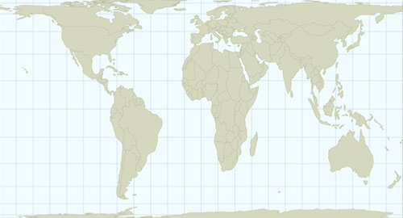
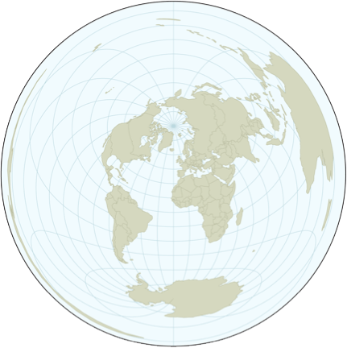
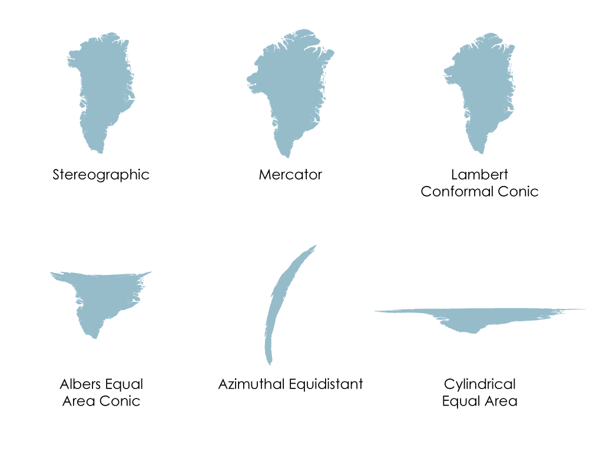
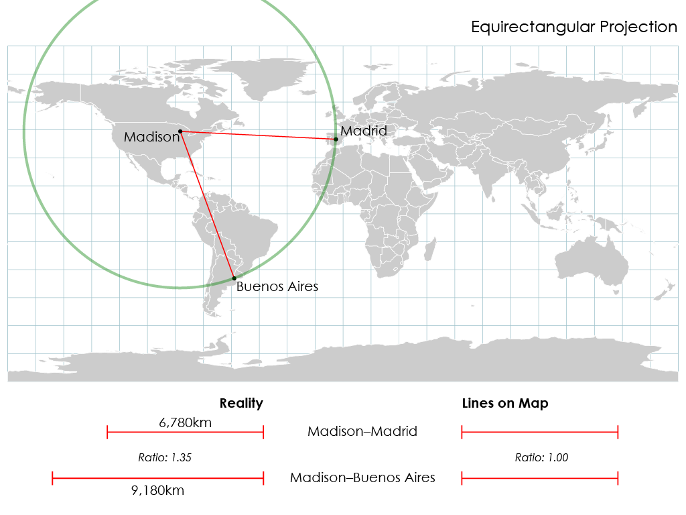
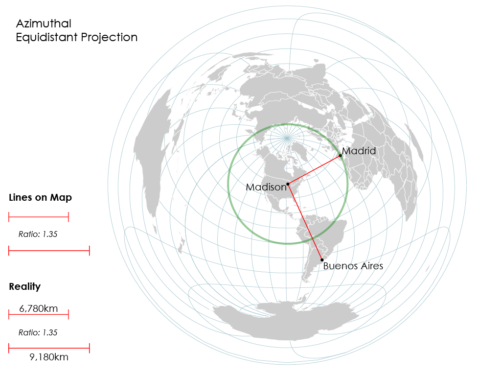
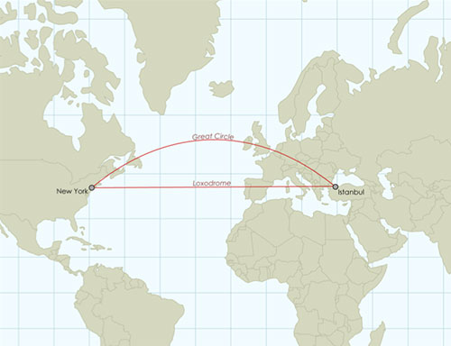
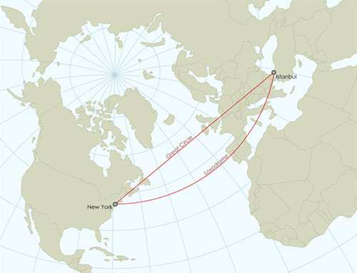
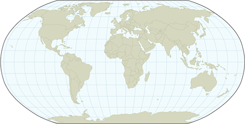
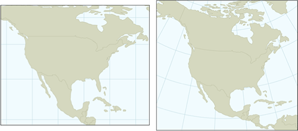
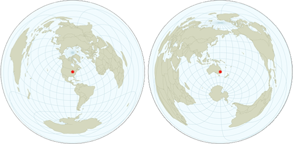

### Flattening the Earth
It's impossible to flatten the Earth without distorting it in some fashion. Consider an orange peel: if you want to try and lay it flat, you have to stretch it, squash it, and tear it. Likewise with the Earth—if we want to make a map, we need to distort the Earth's surface to flatten it. The good news is that map projections allow us to distort systematically; we know exactly how things are being stretched or squashed at any given point. We have many different map projections because each has different patterns of distortion—there is more than one way to flatten an orange peel. Some projections can even preserve certain features of the Earth without distorting them, though they can't preserve everything.

### Projection Properties
We often talk about map projections in terms of the ways in which they distort or preserve certain things about the Earth, which we call *projection properties*. There are four main properties:

#### Area — Some projections distort areas (e.g., Mercator projection)

Notice how Greenland is about as big as South America on a Mercator projection. In reality, South America is eight times larger than Greenland. The Mercator projection doesn't preserve area correctly, especially as you get closer to the poles. On the other hand, one kind of projection that doesn't distort area is the Cylindrical Equal Area.

Notice here how Greenland looks the right size as compared to South America. Projections which preserve areas are called *equivalent* or *equal-area* projections. A map projection either preserves areas everywhere, or distorts it everywhere. This is an all-or-nothing property.

#### Form — Some projections distort the "form" of features (e.g., Azimuthal Equidistant)

On the projection above, look at how Australia, on the right, is unrecognizable, and New Zealand is stretched out into a ring around the left edge of the map. This projection does not preserve the "look" or the "form" of places. It stretches or twists or squashes them, instead. Contrast that with a Lambert Conformal Conic (below), on the other hand, which preserves the general form of the landmasses.

Projections like this are called *conformal* projections. Under the hood, this property is actually a little more complex: comformal projections actually preserve local angles. But what that boils down to for cartographers is that places look more like themselves. In the example below, Greenland is shown as it appears on three conformal projections (top row) and three non-conformal projections (bottom row).

Notice how the conformal projections keep Greenland looking Greenlandy. The shape changes some, and parts of the island get larger or smaller, but they all have the same general form, even if they aren't exactly alike. In the same way, a rectangle and a square have the same general "form" despite being different shapes, whereas a square and a circle do not.

Like equal-area, this property is all-or-nothing; your projection either preserves forms everywhere on the map, or it doesn't preserve them anywhere.

#### Distance — Most projections distort distances (e.g., Equirectangular projection)

A trip from Madison to Buenos Aires is much farther than a trip from Madison to Madrid. But on an Equirectangular projection, both of those trips looks like they're the same length, because this is a projection that does not preserve distance. On the other hand, the Azimuthal Equidistant projection shows distances in the correct proportion.

There's a catch, though. While we have map projections that can preserve areas or form everywhere on the map, there isn't one that can preserve distances everywhere. There are only projections that let you preserve distances relative to just one or two points on the map. Distances to and from the center of an Azimuthal Equidistant map are shown correctly, but distances between any other two points are distorted. When a projection preserves distance, we call it *equidistant*.

**The properties of area, distance, and form are mutually exclusive. If you have a map projection that preserves one, it will distort the other two**

#### Directions — Sometimes a straight line isn’t the shortest path!

New York City and Istanbul are on nearly the same line of latitude, about 41ºN. That means that if you head due east on a straight line from New York, you'll reach Istanbul. But that doesn't mean that this is the shortest distance between the two cities.

In this image, there's a line which shows the straightest, simplest path between New York and Istanbul, which is simply to point yourself east and start flying. But the curved line above it shows the way you should go if you'd like to travel the least distance while getting there. Because the Earth's surface is curved, the shortest paths around it are curved, too. This can be a bit confusing, but makes more sense if you try it yourself: find a globe and place a piece of string on it. Pin one end to New York and one to Istanbul, and pull the string taut. You'll notice that the string covers the exact same path as the curved route in the map above. We call these curved shortest-distance paths *great circle* routes. On the other hand, a path like the straight line, where you keep yourself pointed in the exact same compass direction the whole time, is called a rhumb line or a *loxodrome*.

Some projections, like the Mercator above, show loxodromes as straight lines. They make air and ship navigation easy, because you just have to draw a straight line, point your ship in that direction, and start sailing. Other projections show great circle routes as straight lines, making it easy to figure out the shortest distance between two places. The Stereographic projection is one of these.

Now the straight line is the great circle, and the curved one is the loxodrome. These lines are the same as in the Mercator above, but the projection changes their appearance.

When a projection preserves great circle routes as straight lines, we call it an *azimuthal* projection. Unfortunately, much like the equidistant projections, it only works for one point at a time. In the Stereographic above, the projection is centered on New York. Only straight lines coming into or going out of New York will be great circles. A straight line between Madrid and Casablanca won't be.

#### Compromises — Do nothing perfect, but most things well enough

If you skim through the example images above, you may notice that, as a general trend, distortions tend to get worse and worse as you get near the edges of the map. There's usually one area that looks alright and isn't too distorted, and then things start to get crazy the farther you move away from that area. As an example, on the Azimuthal Equidistant above, Australia's shape gets distorted heavily, but the British Isles look fine. As a general rule, the larger the area your map shows, the worse distortions will be, especially as you move away from the center. What all this means is that we are most worried about distortions when we are doing things like mapping the world, and less when we are mapping smaller areas like cities or states.

To solve the problem of world maps having such severe distortions at the edges, people have come up with compromise projections. These special projections represent trade offs: while most projections have minimal distortion in one area but distort heavily as you move away from that area, compromise projections distort a moderate amount everywhere. The Robinson projection is one example of a compromise projection:

Compromise projections spread the distortion around somewhat evenly. The plus side of this is that no place gets ridiculously distorted. This is what makes compromise projections good for world maps. The downside is that there's no longer a special area that has almost no distortion, like you might find on most other projections. This is why compromise projections should not be used for making maps of continents, countries, or most anything that's not the whole Earth. Compromise projections spread the distortion more evenly throughout the world, but if you're not showing the whole world, you don't need to make the low-distortion areas of the map worse just so the high-distortion areas (which are off the edge of your map) are better.

Compromise projections don't preserve areas or forms or distances, but they get close on all of them. They have a low level of distortion overall, even if they don't preserve any one thing exactly. If the map you're making requires that you preserve something specific like area, a compromise projection won't meet your needs.

### Choosing a Projection

Since there are so very many projections, the question becomes: which one should you use? As you may imagine, the fact that there are so many means there is no “best” projection. Each has advantages and disadvantages and is better suited to certain situations. Here are some questions to ask yourself when choosing a projection:

**Is there any specific property that you need to preserve?** Remember that some projections will keep areas, forms, distances, or directions free of distortion. Sometimes, the subject your mapping is better served by preserving one of these properties. Here are some examples:

* **Area** — Maps of density demand equal area projections. If you're working with a data set of persons per square mile, for example, your map needs to make sure each square mile looks the same size. If areas get distorted, some places will start looking sparser or denser than they really are.
* **Form** — Conformal projections are often good for general-purpose reference mapping, where we want to keep places looking recognizable and familiar. They are also often used for navigational charts. By preserving local angles, they don't distort paths—a 45º turn on the Earth looks like a 45º turn on the map, whereas if angles were distorted, this would not be the case.
* **Distance** — If you'd like to show, visually, how far one thing is from another, you're going to need to preserve distance. Sometimes airports use these to show the cities they fly to.
* **Direction** — Also helpful for navigation. Sometimes it's useful to show loxodromes as straight lines: the Mercator, for example, was invented for Renaissance sailors, to make it easier for them to plot courses. They could draw a straight line on the map, and this would tell them exactly which compass heading to use to head home. On the other hand, if you're piloting an airplane, you might want to show great circles as straight lines, so that you can get from A to B while using the least fuel.

There are plenty of other reasons to preserve each of these properties; the above are simply examples to get you thinking. Some other considerations:

* **How big of an area are you mapping?** If you're mapping the world (and don't need to preserve a specific property), a compromise projection is your best bet.
* **Does the area of your map tend to run North-South or East-West?** Different projections have different distortion patterns. Some, like the Albers Equal Area Conic, distort more as you go north or south, but don't distort much as you go east or west. So, they're good for mapping an area like the United States. They're not so good for mapping a country like Chile, though, which runs north-south. The Transverse Mercator (different from plain Mercator) distorts a lot east-west, but doesn't distort very much north-south, so it would be a better choice for Chile.
* **What will your readers think about it?** For example, while many readers may be familiar with the Mercator, the less familiar distortions they see on an Azimuthal Equidistant may throw them off (or, perhaps, intrigue them and cause them to pay more attention to your map). Likewise, people are used to seeing the US mapped with something like an Albers Equal Area Conic, which gives it a curved appearance; seeing the US on a Cylindrical Equal Area might not look “right” to some readers, despite there being nothing wrong with either projection.

### Projection Parameters

Once you know what projection you're going to be using, there's one final step. As we discussed above, each projection has places where distortion is worse, and places where it is not too bad. Fortunately, we get to pick the place where distortions are minimal when we're setting up a projection. This means we can always make sure that the subject of our map is the part that has the least distortion. We do this by adjusting the parameters of the projection. Take a look at these two maps, made with the Azimuthal Equidistant projection:

Both use the same projection, but each one has different parameters. The one on the left has been set so that the center of the area with the least distortion is around the Great Lakes, while on the right, the map has been centered on southeast Australia. They're both still Azimuthal Equidistant projections, meaning they show distances correctly when measured out from the center of the projection, but they each have different center points. By adjusting this parameter, we can make sure that when we use a projection, it's properly adjusted to show the area we want to map with minimal distortion.

Different projections have different parameters that you'll need to specify based on their mathematical workings, which we'll leave behind the scenes for now. If your projection requires a center longitude and/or a center latitude, enter coordinates that are in the center of the area you're mapping. As in the above example, you'll be setting it so that the projection minimizes distortions in the area you're mapping.

Some projections, such as Albers Equal Area Conic, require that you input *standard lines*, either in addition to center coordinates or in place of them. These are lines of latitude along which your projection will have no distortion. For example, a standard line at 30ºN means that your projection will have no distortions at at that latitude, though distortions will spread outward north and south from these lines – 31ºN will be a bit distorted, 32ºN will be worse than 31ºN, etc. Some projections need one standard line, others will let you enter two. If you are entering one, set the standard line to the latitude that's in the center of your map; again, we're making sure that the area of least distortion is the area you're mapping, rather than somewhere far off. If you have an opportunity to enter two standard lines, the best practice is a bit more complicated. Set the standard lines so that they divide your map approximately into thirds, as in the example below:

By doing this, you're making sure that no point in your map is very far from a standard line—from one of those places where there's no distortion. This means that the distortion is minimized across the entire map.

### Our Recommendations

There is never a single "right answer" when choosing a map projections; the best choices depend on weighing all the factors described above. However, there are few facts and rules of thumb that can help narrow your choices. If you're working with web maps, you will often have no choice but Mercator. Be aware that this projection is widely considered inappropriate for many kinds of thematic mapping for anything larger than local areas, so be careful, and avoid Mercator outside those web environments. If you are making [choropleth](choropleth.html) or [dot density](dot_density.html) maps, look for an equal-area projection. For a handy guide to a variety of projections and their uses, see [these tables](http://www.radicalcartography.net/index.html?projectionref) by Bill Rankin.
