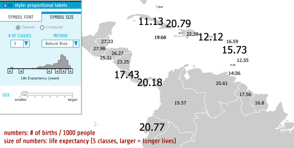

### When to Use

Proportional labels take two very intuitive map forms-simple map labels and [graduated / proportional symbol](../articles/proportional_symbols.html) maps-and combine them to create a simple bivariate map that tells us two things about each location on the map. On these maps the text denotes one data set and the size of those characters denotes the second. The first dataset, which is the alphanumeric content of the labels themselves, can be any numerical or categorical data, or even just names (e.g., names of countries). However, the second dataset which is used to scale the size of those labels must be numerical data or ordinal data prepared as simple numerical ranks (1, 2, 3, ...); numbers are required to do the "scaling" of the point sizes. We support both [classed and unclassed](../articles/classification.html) proportional labels and the scaling of the symbols uses directly proportional scaling, or simpler graduated sizes (between 2 - 8 classes).

One modest advantage of proportional label maps is they work well without color and can be printed and photocopied successfully in black and white. The only other bivariate thematic map in indiemapper that can do that is a [bivariate graduated symbol map](../articles/bivariate_graduated.html) using a gray-scale [sequential color ramp](../articles/color_schemes.html).

### Concerns

Proportional label maps inherent the problems of any [graduated / proportional map](../articles/proportional_symbols.html), namely that folks aren't very good at estimating sizes of map symbols, especially on complex maps with many map symbols. Additionally, because proportional label maps use complex shapes (letters and numbers) and not simple shapes (circles, squares) there is reason to believe that our ability to accurately compare and rank symbol sizes will be further impaired. This, then, argues for using only a few distinct symbol sizes, in other words, classed data. As seen in the example map below, there are three sizes of labels, each noticeably different than the other, and it is unlikely folks would think Columbia and Panama are in the same size class. This is not to rule out the value of an unclassed proportional label maps (aka "continuous direct scaling"), but do appreciate that small size differences are not as easily seen.

### Example Map

In the example below, the numbers tell us the birth rates of the countries (# of births per 1,000 people), while the size of the numbers tells us about the average life expectancy of those countries. For example, although Cuba and Panama have very different birth rates (11.13/1,000 versus 20.18/1,000), we know they have similar life expectancies because their text is the same point size. By comparison, Haiti has a very short average life expectancy, sadly, which is shown on the map by the very small text (it is in the lowest class for life expectancy in the world).

