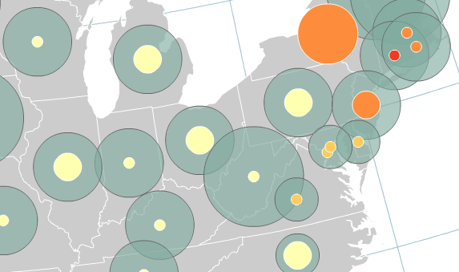

### When to Use

Proportional symbol maps scale the size of simple symbols (usually a circle or square) proportionally to the data value found at that location. They are a simple concept to grasp: The larger the symbol, the "more" of something exists at a location. The most basic method is to **scale the circles directly proportionate to the data** so that if, for example, Toronto has twice the population of Vancouver, the population symbol for Toronto will have **twice the area**. However, you can also group your observations into categories or numerical ranges and created **graduated symbol maps** that may, for example, only have three symbol sizes corresponding to three categories of city size (e.g., cities of <1 million, 1-4 million, and over 4 million people). The pros and cons of proportional versus graduated symbols are discussed in more detail below.

See [data classification](../articles/classification.html) for a more general discussion (should you chose to go down that road here).

One further note: With 2D proportional symbols like circles and squares (see example below), it is the _area_ of the symbols that encodes the data, not their _height_ or _length_.

### Reasons Why We Like Them

Proportional symbol maps are very flexible because you can use either **numerical data** (e.g., income, age) or **ordered categorical data** (e.g., low, medium, and high risk of bankruptcy). They're also flexible because they can be used for data attached to geographic points (e.g., a precise location) or data attached to geographic areas (e.g., countries).

One advantage of proportional symbol maps over [dot density maps](../articles/dot_density.html) is it is generally easier for map readers to extract numbers from the map since estimating the size of a symbol is less tedious than counting many little dots. An advantage of proportional symbol maps over [choropleth maps](../articles/choropleth.html) is that the size of the enumeration unit doesn't matter: If a country with a small geographic area, such as the Netherlands, has a large data value attached to it, it will have a large symbol over it. By comparison, on a choropleth map, smaller places are easily overlooked on a busy map—even if they have large data values—while large countries such as Canada dominate the map no matter what color they are. It can be argued, thus, that proportional symbol maps "let the thematic data speak for itself," since the size of the symbols relates directly to the thematic data and not just the footprint of the enumeration unit. Lastly, unlike choropleth maps, proportional symbol maps can use either _raw data_ (totals, counts) or _standardized data_ (percentages, rates, ratios); choropleth maps should only be made with [standardized data](../articles/standardize.html).

Example datasets appropriate for proportional symbol maps:

*   liters of coffee consumed per capita in 2010 by country
*   location and magnitude of earthquakes in California 1900-2010
*   estimated likelihood of a major earthquake for cities in California (low, medium, and high risk)
*   population totals of the 50 largest cities in China

### Example Single-Variable Proportional Symbol Map

The proportional symbols used on this map (above) encode the elevation of cities in California: the bigger the square, the higher the elevation. Squares and circles are good choices because they're compact, and simple shapes make visually estimating and comparing sizes easier. Try adjusting both the symbol fill and stroke color and transparency, or perhaps you'd prefer just fill or just stroke—we often make proportional symbol maps without any fill color if the color might compete with other map content.

### Example Multi-Variable Proportional Symbol Map

One of the nice features about proportional symbol maps is that they play well together and you can encode **multiple data variables into a compound symbol** (see also [multivariate maps](../articles/multivariate.html). In the example above, we show three different numbers for each US state: The size of the translucent green circles encodes one variable, the size of the white circles a second, and the color fill of those white circles a third variable.

By experimenting with (1) layer order, (2) transparency, (3) fill (or no fill), and (4) size, you can create surprisingly rich maps like this one. Just be sure that the variables you are mapping together make sense being together on the same map, that is to say, that they are related conceptually or causally. For example, income + years of education + risk of heart attack are partially co-related data and would make an interesting multivariate map.

### Limitations

A common problem with proportional symbol maps is symbol congestion/overlap, especially if there are large variations in the size of symbols or if numerous data locations are close together (see the California map above for an example of this). Using symbol transparency is one (partial) solution which allows overlapping symbols to show through. Another solution is to physically move the symbols apart, manually, and give everything a bit more room, although this runs the risk of disassociating a symbol from its location and your readers might no longer know which symbol goes with which place (which is worse than symbol congestion).

_If the small square represents 1,000 people, how many people does the big square represent?
 The answer may surprise you (see below)_

Another common problem with proportional symbol maps is that map readers generally **do not estimate the areas of symbols very well.** In fact, most of us are downright terrible at it. Extensive testing has shown that most people systematically under-estimate differences in area, and the degree of underestimation grows worse the bigger the differences between map symbols. In the example, the big square has 36 times the area of the smaller, so it represents 36,000 people.

_**Solutions?**_ A carefully designed legend can help, but perhaps the best solution is to simply classify your data and only use a few discrete symbols sizes, e.g., small, medium, and large circles in which the differences are easily noticed. Summarizing years of research on this topic: the loss of data detail suffered in grouping our data into classes is compensated for by fewer map reading errors. Of course, [classification](../articles/classification.html) introduces an element of subjectivity into our work because we must make the twin decisions of (1) how many data classes and (2) how to group/classify our data (e.g., equal interval? natural breaks?).

For a longer discussion about the challenges of grouping observations into data classes, see [data classification](../articles/classification.html).

_**Not sure you should use a proportional symbol map?**_ Potential alternatives include [choropleth](../articles/choropleth.html) maps (if your data can be standardized and are attached to enumeration units), [dot density](../articles/dot_density.html) maps, and [cartograms](../articles/cartograms.html).

### Our Recommendations

Proportional symbol maps (unclassed data) and graduated symbol maps (classed data) are both highly flexible ways to represent a very broad range of data types. They also side-step some of the problems of choropleth maps. However, they can also become very busy and congested with symbols (hard to read), in which case you might want to consider alternate maps such as dot density, cartogram, or choropleth since their suitability for you is ultimately determined by your purpose, your data, and your audience.