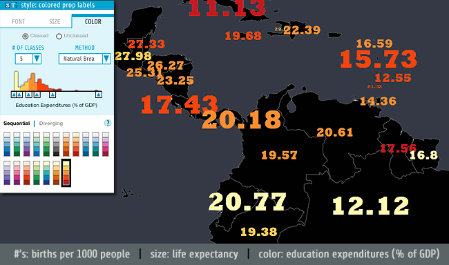

### When to Use

Colored proportional labels combine three datasets into a single compound map symbol: The text denotes one data set, the size of those characters denotes the second, and the color of the text denotes the third. While the first dataset can be any number, category, or name, the second (size) and third (color) datasets must be numerical data or ordinal data prepared as simple numerical ranks (1, 2, 3, ...); numbers are required to do the "scaling" of the text and ordering of the colors. We support both [classed and unclassed](../articles/classification.html) colored proportional labels so that there can be a fixed number of sizes and colors (we recommend 3-8 classes), or you can map raw data directly to those symbols. For more information about the pros and cons of using classed versus unclassed approaches to mapping, see the discussion [here](../articles/choropleth.html.

Colored proportional symbols allow us to show a lot of data in a fairly compact map symbol that remains easy to read: for example, readers could quickly find all the large red numbers to know that those places share two properties and then evaluate how they compare on the third (the actual number seen).

### Concerns

These maps inherent the problems of any [graduated / proportional map](../articles/proportional_symbols.html, namely that folks aren't very good at estimating sizes of map symbols, especially on complex maps with many map symbols. Also, because colored proportional label maps use complex shapes (letters and numbers) and not simple shapes (circles, squares) there is reason to believe that our ability to accurately compare and rank symbol sizes will be further impaired. This, then, argues for using only a few distinct symbol sizes, in other words, classed data. In the example map below (and the panel) there are five sizes of labels, each noticeably different from the others, and it is unlikely folks would think Colombia and Panama are in the same size class. This is not to rule out the value of an unclassed proportional label maps (aka "continuous direct scaling"), but to say that small size differences are not as easily seen.

### Example Map

In the example below, the numbers tell us the birth rates of the countries (# of births per 1000 people), the size of the numbers tells us about the average life expectancy of those countries (in years, using five classes), and the colors tell us about education expenditures as a % of GDP. So, for example, we know that the light yellow countries spend the same, roughly, on education, but have very different birth rates and life expetencies.The ability to explore these kinds of complex relationships on a single map is the appeal of multivariate mapping.

